---
## Author
author:
  name: Карпухин Клим
  degrees: ""
  orcid: ""
  email: 1032255580@rudn.ru
  affiliation:
    - name: "Российский университет дружбы народов"
      country: "Российская Федерация"
      postal-code: 117198
      city: "Москва"
      address: "ул. Миклухо-Маклая, д. 6"
## Title
title: "Выполнение лабораторной работы №1"
subtitle: "Установка ОС Linux"
license: "CC BY"
date: 2026-03-01
date-format: "YYYY-MM-DD"
slide_level: 2

format:
  beamer:
    classoption: "aspectratio=169"
    pdf-engine: xelatex
    number-sections: false
    toc: false
    keep-tex: true

mainfont: "DejaVu Serif"
monofont: "DejaVu Sans Mono"
sansfont: "DejaVu Sans"
---

# Содержание

1. Информация о докладчике
2. Вводная часть и актуальность
3. Объект и предмет исследования
4. Цель, гипотеза, задачи
5. Материалы, методы и инструменты
6. Ход работы (этапы, скриншоты)
7. Результаты и анализ
8. Выводы
9. Контрольные вопросы
10. Список литературы

---

# Информация

## Докладчик

::: {.columns align="center"}
::: {.column width="65%"}

* **Карпухин Клим**
* Российский университет дружбы народов
* Email: [1032255580@rudn.ru](mailto:1032255580@rudn.ru)
* Роли: студент (лабораторная работа по ОС/виртуализации)

:::
::: {.column width="35%"}
{width="90%"}
:::
:::

---

# Вводная часть

## Актуальность

* Практические навыки установки и конфигурирования Linux необходимы для изучения системного администрирования и разработки.
* Виртуальные машины позволяют безопасно экспериментировать с ОС, не рискуя основной системой.

## Объект и предмет исследования

* **Объект:** виртуальная машина с установленной ОС Linux.
* **Предмет:** процесс установки ОС Fedora (Sway), базовая конфигурация и получение системной информации.

---

# Научная новизна и практическая значимость

## Научная новизна

* Демонстрация практической последовательности установки и конфигурации минимального рабочего окружения (Sway) и автоматизации обновлений в виртуальной среде.

## Практическая значимость

* Полученные навыки пригодны для развертывания тестовых сред, преподавания лабораторных работ и подготовки документации (pandoc + TeX Live).

---

# Цель, гипотеза и задачи

## Цель

Приобрести практические навыки установки и базовой настройки ОС Linux на виртуальной машине.

## Гипотеза

Правильная настройка виртуальной машины и минимальный набор системных пакетов обеспечат рабочее окружение, пригодное для дальнейших лабораторных и исследовательских работ.

## Задачи

* Создать виртуальную машину (VirtualBox/QEMU).
* Установить Fedora (Sway).
* Настроить базовые сервисы, автоматические обновления, отключить SELinux (по заданию).
* Получить и зафиксировать системную информацию (ядро, CPU, память, FS, гипервизор).

---

# Материалы и методы

## Оборудование / ПО

* Hypervisor: VirtualBox (гипервизор второго типа).
* Дистрибутив: Fedora (вариант Sway).
* Утилиты и инструменты: `dnf`, `systemd`, `tmux`, `pandoc`, `TeX Live`.

---

# Ход работы — подготовка виртуальной машины (этапы)

1. Создание VM в GUI VirtualBox (указано имя согласно логину) ([рис. @fig-001]).
   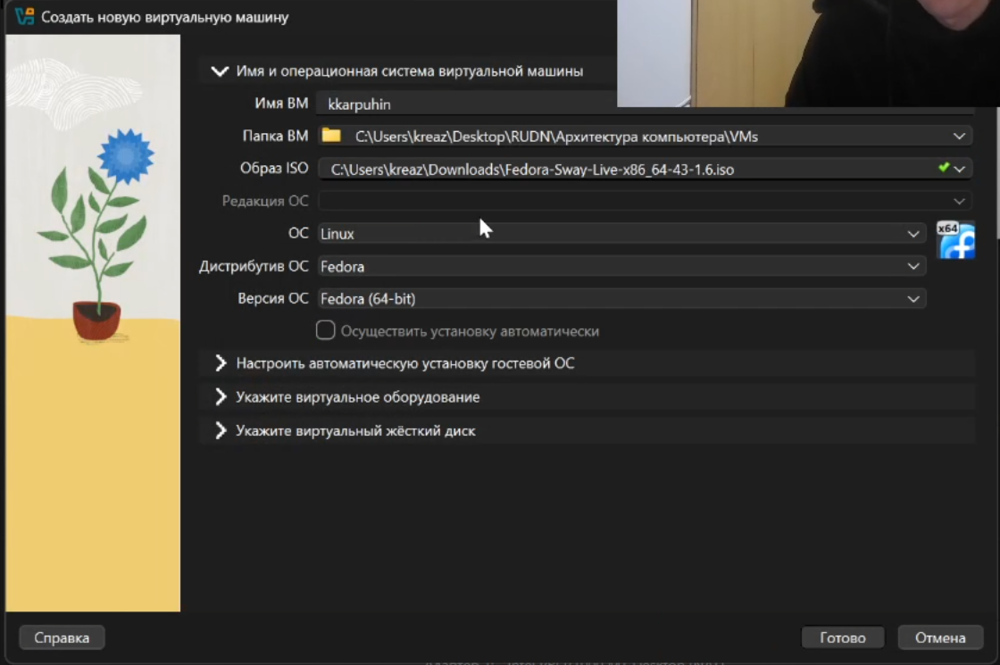{#fig-001 width="70%"}
2. Указание объёма RAM — 6107 МБ ([рис. @fig-002]).
   {#fig-002 width="70%"}
3. Размер виртуального диска — 80 ГБ ([рис. @fig-003]).
   {#fig-003 width="70%"}
4. Графический контроллер — VMSVGA; включено 3D-ускорение ([рис. @fig-004], [рис. @fig-005]).
   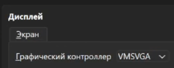{#fig-004 width="70%"}
   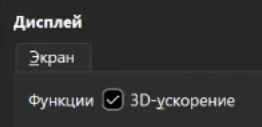{#fig-005 width="70%"}
5. Включены общий буфер обмена и drag'n'drop ([рис. @fig-006]).
   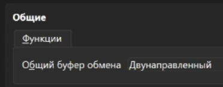{#fig-006 width="70%"}
6. Включена поддержка UEFI ([рис. @fig-007]).
   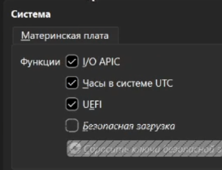{#fig-007 width="70%"}

---

# Ход работы — установка и базовая настройка

1. Установка системы с Live-ISO, разметка диска, ввод пользовательских данных, установка загрузчика ([рис. @fig-008]).
   {#fig-008 width="70%"}
2. Переключение на root и установка средств разработки ([рис. @fig-009]).
   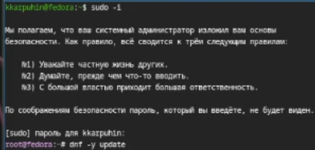{#fig-009 width="70%"}
3. Обновление пакетов (`dnf update`) ([рис. @fig-010]).
   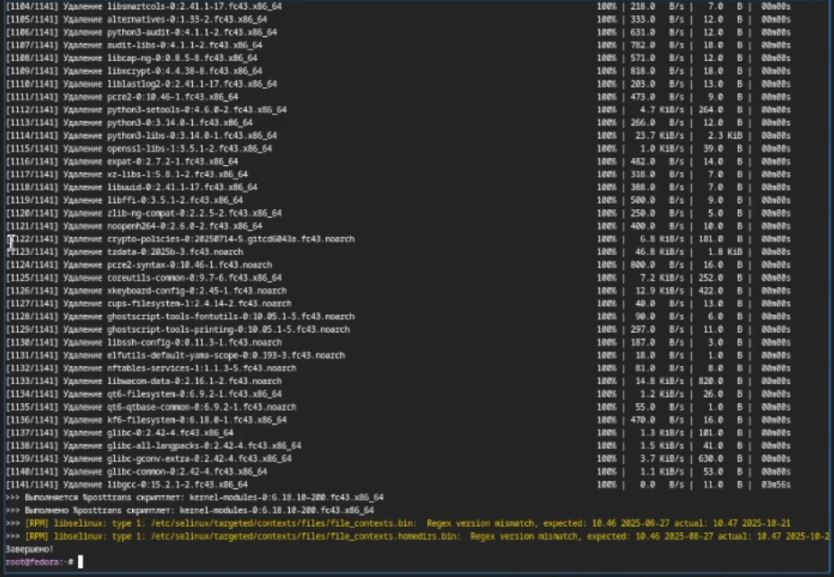{#fig-010 width="70%"}
4. Установка удобных утилит для терминала ([рис. @fig-011]).
   {#fig-011 width="70%"}
5. Установка и запуск `dnf-automatic` (или аналог) — автоматические обновления ([рис. @fig-012]).
   {#fig-012 width="70%"}
6. Отключение SELinux (по заданию) ([рис. @fig-013]).
   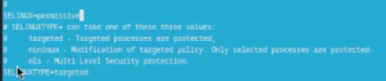{#fig-013 width="70%"}

---

# Ход работы — конфигурация рабочего окружения

* Запуск `tmux` для удобства работы в терминале ([рис. @fig-014]).
  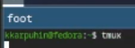{#fig-014 width="70%"}
* Создание и редактирование конфигурации Sway: `~/.config/sway/config.d/95-system-keyboard-config.conf` ([рис. @fig-015]).
  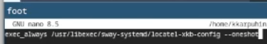{#fig-015 width="70%"}
* Редактирование конфигураций от root (привилегии) ([рис. @fig-016], [рис. @fig-017]).
  {#fig-016 width="70%"}
  {#fig-017 width="70%"}
* Установка имени хоста и проверка ([рис. @fig-018]).
  {#fig-018 width="70%"}

---

# Документация и подготовка отчёта

* Установка `pandoc` для подготовки отчёта в Markdown → PDF/HTML ([рис. @fig-019]).
  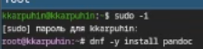{#fig-019 width="70%"}
* Установка TeX Live для сборки PDF через LaTeX ([рис. @fig-020]).
  {#fig-020 width="70%"}

---

# Домашнее задание — полученные системные данные

* Версия ядра Linux ([рис. @fig-021]).
  {#fig-021 width="70%"}
* Частота процессора ([рис. @fig-022]).
  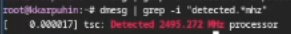{#fig-022 width="70%"}
* Модель процессора ([рис. @fig-023]).
  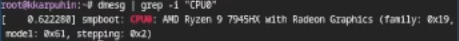{#fig-023 width="70%"}
* Тип обнаруженного гипервизора ([рис. @fig-024]).
  {#fig-024 width="70%"}
* Тип файловой системы корня ([рис. @fig-025]).
  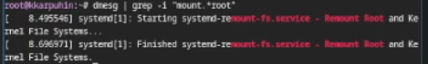{#fig-025 width="70%"}
* Доступная оперативная память ([рис. @fig-026]).
  {#fig-026 width="70%"}
* Последовательность монтирования файловых систем ([рис. @fig-027]).
  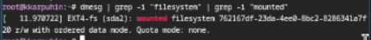{#fig-027 width="70%"}

---

# Анализ и практическая значимость результатов

* Установка и базовая настройка выполнены последовательно: VM → ОС → пакеты → конфигурация.
* Автоматизация обновлений и установка инструментов разработки делают систему готовой к дальнейшим лабораторным.
* Полученная системная информация позволяет документировать и воспроизвести окружение.

---

# Выводы (общее заключение)

* Освоены базовые приёмы установки и конфигурации Linux в виртуальной машине.
* Научились получать и фиксировать ключевые данные о системе (ядро, CPU, FS, гипервизор, память).
* Отчёт оформлен в Markdown; результат может быть экспортирован в PDF/HTML с помощью pandoc и TeX Live.

---

# Контрольные вопросы (ключевые ответы)

1. Информация учётной записи пользователя:

   * Системное имя; UID; GID; полное имя; домашний каталог; начальная оболочка.

2. Примеры команд:

   * Справка: `--help` (пример: `ls --help`)
   * Текущий путь: `pwd`
   * Смена каталога: `cd`, `cd ..`, `cd ~`
   * Просмотр: `ls`, `ls -la`
   * Размер каталога: `du -sh`
   * Создать каталог/файл: `mkdir`, `touch`
   * Удаление: `rmdir` (пустой), `rm -r` (с содержимым), `rm` (файл)
   * Права: `chmod`, `chown`
   * История: `history`

3. Файловые системы:

   * `ext4`, `xfs`, `btrfs`, `vfat`, `ntfs`.

4. Просмотр смонтированных ФС:

   * `mount`, `findmnt`, `df -T`, `cat /proc/mounts`.

5. Удаление зависшего процесса:

   * Поиск: `ps aux | grep <name>`, `top`
   * Остановка: `kill <PID>`

---

# Рекомендации по продолжению работы

- Откатить отключение SELinux только при наличии обоснования, по умолчанию SELinux рекомендуется держать включённым.
- Настроить бэкап/снапшоты виртуальной машины перед экспериментами.
- Внедрить управление конфигурацией (Ansible) для повторяемости настроек.
