---
## Author
author:
  name: Карпухин Клим
  degrees: 
  orcid: 
  email: 1032255580@rudn.ru
  affiliation:
    - name: Российский университет дружбы народов
      country: Российская Федерация
      postal-code: 117198
      city: Москва
      address: ул. Миклухо-Маклая, д. 6

## Title
title: "Выполнение лабораторной работы №1"
subtitle: "Установка ОС Linux"
license: "CC BY"
---

# Цель работы

Целью данной работы является приобретение практических навыков установки операционной системы на виртуальную машину, настройки минимально необходимых для дальнейшей работы сервисов.

# Задание

Установить Linux на виртуальную машину, освоить базовые комманды терминала Linux и получить системную информацию.

# Теоретическое введение

**Виртуализация**. Технология запуска изолированных виртуальных машин на одном хосте. В работе используются гипервизоры второго типа: Virtualbox и QEMU. Виртуальная машина имитирует CPU, оперативную память, чипсет и материнскую плату, BIOS, видеоадаптер, жёсткий диск, сетевые карты, звуковые карты, USB-контроллеры, порты ввода-вывода.

**OC Linux и дистрибутив**. Linux - ядро ОС, дистрибутивы объединяют ядро с пакетами и инструментами. В работе используется Fedora (вариант Sway) c менеджером пакетов dnf и systemd.

**Оконный менеджер Sway** - это тайловый оконный менеджер для Wayland, минималистичен, ориентирован на клавиатуру.

**Краткий ход установки**. Загрузка Live-ISO; разметка виртуального диска; выбор языка, раскладки и часового пояса; создание пользователя и указание хоста; установка загрузчика; перезагрузка.

**Файловая система**. Иерархия с корнем / и каталогами /etc, /home, /var и т.п. Частые форматы: ext4, xfs, btrfs. Важно понимать точки монтирования в fstab.

**Пользователи и права**. У каждого пользователя есть логин, UID, домашний каталог и набор групп. Права: чтение/запись/исполнение для владельца, группы, и остальных.

**Обновления и пакеты**. В Fedora управление пакетамим осуществляется через dnf (установка, обновление). Для автоматических обновлений доступен dmf-automatic.

**Документация**. Для подготовки отчёта используются инструменты pandoc и TeX Live.

# Выполнение лабораторной работы

Создал новую виртуальную машину в графическом интерфейсе Virtualbox и указал имя виртуальной машины в соответствии с моим логином в дисплейном классе. ([рис. @fig-001]).

{#fig-001 width=70%}

Указал размер основной памяти виртуальной машины - 6107 мб.([рис. @fig-002]).

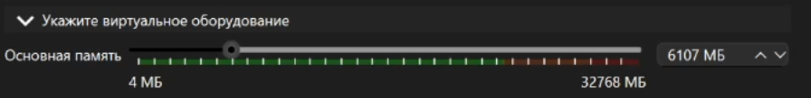{#fig-002 width=70%}

Задал размер диска 80 гб.([рис. @fig-003]).

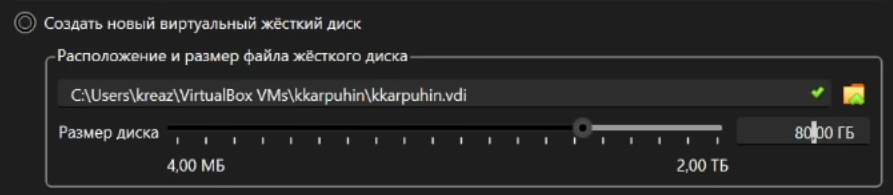{#fig-003 width=70%}

В качестве графического контроллера поставил VMSVGA.([рис. @fig-004]).

{#fig-004 width=70%}

Включил ускорение 3D.([рис. @fig-005]).

{#fig-005 width=70%}

Включил общий буфер обмена и перетаскивание объектов между хостом и гостевой ОС.([рис. @fig-006]).

{#fig-006 width=70%}

Включил поддержку UEFI.([рис. @fig-007]).

{#fig-007 width=70%}

Установил систему на диск.([рис. @fig-008]).

{#fig-008 width=70%}

Перелкючился на роль суперпользователя и установил средства разработки.([рис. @fig-009]).

{#fig-009 width=70%}

Обновил все пакеты.([рис. @fig-010]).

{#fig-010 width=70%}

Установил программу для удобства работы в консоли.([рис. @fig-011]).

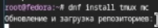{#fig-011 width=70%}

Установил программное обеспечентие для автоматического обновления и запустил таймер.([рис. @fig-012]).

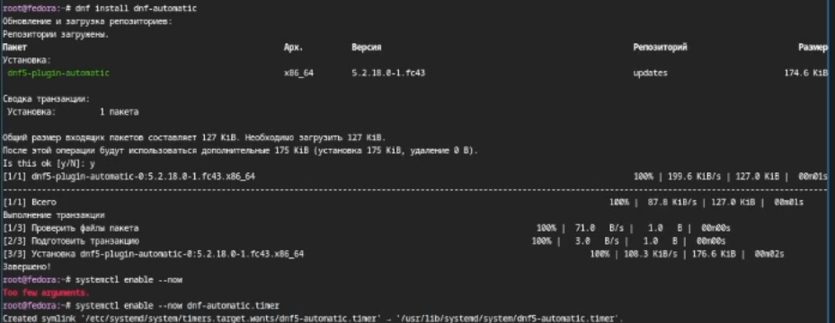{#fig-012 width=70%}

Отключил систему безопасности SELinux.([рис. @fig-013]).

{#fig-013 width=70%}

Запустил терминальный мультиплексор tmux.([рис. @fig-014]).

{#fig-014 width=70%}

Создал и отредактировал конфигурационный файл ~/.config/sway/config.d/95-system-keyboard-config.conf.([рис. @fig-015]).

{#fig-015 width=70%}

Переключился на роль супер-пользователя и открыл конфигурационный файл.([рис. @fig-016]).

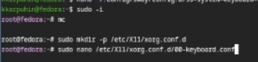{#fig-016 width=70%}

Отредактировал конфигурационный файл.([рис. @fig-017]).

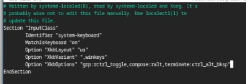{#fig-017 width=70%}

Установил имя хоста и проверил изменеия.([рис. @fig-018]).

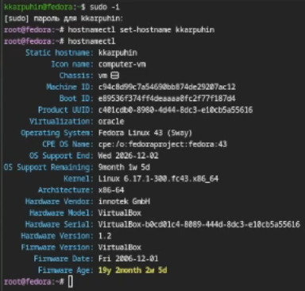{#fig-018 width=70%}

Запустил терминальный мультиплексор tmux, переключился на роль супер-пользователя, установил программное обеспечение для создания документации pandoc.([рис. @fig-019).

{#fig-019 width=70%}

Установил дистрибутив TeXLive.([рис. @fig-020).

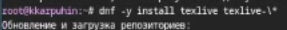{#fig-020 width=70%}

# Домашнее задание

Получил версию ядра Linux.([рис. @fig-021).

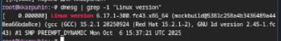{#fig-021 width=70%}

Получил частоту процессора.([рис. @fig-022).

{#fig-022 width=70%}

Получил модель процессора.([рис. @fig-023).

{#fig-023 width=70%}

Получил тип обнаруженного гипервизора.([рис. @fig-024).

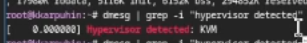{#fig-024 width=70%}

Получил тип файловой системы корневого раздела.([рис. @fig-025).

{#fig-025 width=70%}

Получил объём доступной оперативной памяти.([рис. @fig-026).

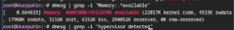{#fig-026 width=70%}

Получил последовательность монтирования файловых систем.([рис. @fig-027).

{#fig-027 width=70%}

# Выводы

В ходе работы были освоены базовые приёмы работы в терминале Linux и оформления результатов в Markdown. С помощью dmesg и фильтрации grep получены ключевые сведения о системе. Полученные результвты зафиксированны в отчёте и подтверждены снимками экрана и скринкастами

# Контрольные вопросы

1. Учётная запись пользователя содержит такую информацию, как:
- Системное имя
- Идентификатор пользователя
- Идентификатор группы
- Полное имя
- Домашний каталог
- Начальная оболочка

2. Команды терминала и примеры:

- Справка: --help (ls --help)
- Текущий путь: pwd (pwd)
- Смена каталога: cd (cd /etc); cd ..; cd ~
- Просмотр содержимого: ls (ls); ls -la (ls -la /var/log)
- Размер каталога: du -sh (du -sh)
- Создание каталога: mkdir (mkdir testdir)
- Создание файла: touch (touch testfile.txt)
- Удаление каталога: rmdir (пустой); rm -r (с содержимым) (rm -r testdir)
- Удаление файла: rm (rm testfile.txt)
- Управление правами: chmod (chmod 644 file); chown (sudo chown user:group file)
- История команд: history (history)

3. **Файловые система** - это способ организации и хранения данных на физическом носителе, определяющий структуру каталогов, правила именования и доступа к файлам.
Примеры:
- ext4: журналируемая, стандартная для Linux.
- xfs: высокая производительность, журналируемая.
- btrfs: снапшоты, сжатие, подтома.
- vfat (FAT32): совместимость, ограничения 4 ГБ.
- ntfs: файловая система Windows (поддержка в Linux).

4. Просмотр смонтированных в ОС систем:
- mount
- findmnt
- df -T
- cat /proc/mounts 

5. Удаление зависшего процесса: 
Поиск процесса:
- ps aux | grep название_процесса
- top

Остановка процесса:
- kill PID

# Список литературы{.unnumbered}

::: {#refs}
:::
