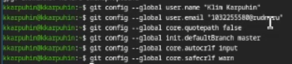
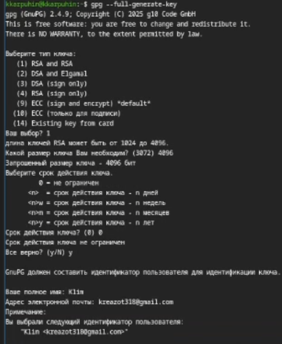
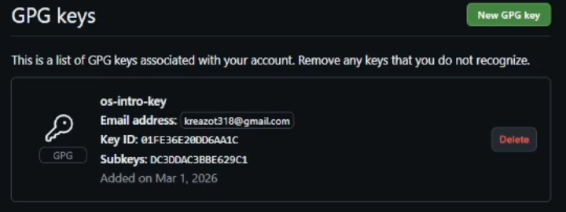
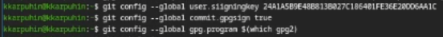
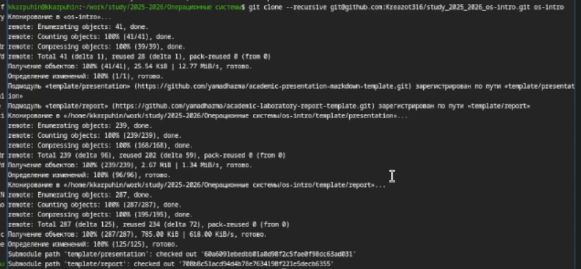
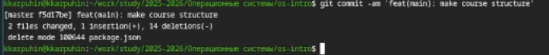

---
## Author
author:
  name: Карпухин Клим
  degrees: ""
  orcid: ""
  email: 1032255580@rudn.ru
  affiliation:
    - name: "Российский университет дружбы народов"
      country: "Российская Федерация"
      postal-code: 117198
      city: "Москва"
      address: "ул. Миклухо-Маклая, д. 6"
## Title
title: "Выполнение лабораторной работы №2"
subtitle: "Первоначальная настройка git"
license: "CC BY"
date: 2026-03-01
date-format: "YYYY-MM-DD"
slide_level: 2

format:
  beamer:
    classoption: "aspectratio=169"
    pdf-engine: xelatex
    number-sections: false
    toc: false
    keep-tex: true

mainfont: "DejaVu Serif"
monofont: "DejaVu Sans Mono"
sansfont: "DejaVu Sans"
---

# Содержание

1. Информация о докладчике
2. Вводная часть и актуальность
3. Объект и предмет исследования
4. Цель работы
5. Задачи
6. Материалы, методы и инструменты
7. Ход работы (этапы, скриншоты)
8. Результаты и анализ
9. Выводы

# Информация

## Докладчик

::: {.columns align="center"}
::: {.column width="65%"}

* **Карпухин Клим**
* Российский университет дружбы народов
* Email: [1032255580@rudn.ru](mailto:1032255580@rudn.ru)
* Роли: студент (лабораторная работа по ОС/виртуализации)

:::
::: {.column width="35%"}
{width="90%"}
:::
:::

# Вводная часть

## Актуальность

* Системы контроля версий (VCS) — стандарт современной разработки.
* Git является наиболее распространённой распределённой VCS.
* Платформа GitHub — ключевой инструмент для хостинга проектов и командной работы.
* Владение Git необходимо для учёбы, исследований и будущей профессиональной деятельности.

## Объект и предмет исследования

* **Объект:** система контроля версий Git и платформа GitHub.
* **Предмет:** процесс первичной настройки окружения для работы с Git, включая аутентификацию и верификацию.

# Цель и задачи

## Цель

Изучить идеологию и применение средств контроля версий, освоить базовые навыки работы с git.

## Задачи

* Создать базовую конфигурацию для работы с git.
* Создать ключ SSH и ключ PGP.
* Настроить автоматические подписи коммитов.
* Зарегистрироваться на GitHub.
* Создать локальный каталог для выполнения заданий по предмету.

# Материалы и методы

## Материалы и методы

* **Инструменты**
  * Git — распределённая система контроля версий.
  * Утилита `gh` (GitHub CLI) для работы с GitHub.
  * SSH для безопасного подключения к удалённым репозиториям.
  * GnuPG (gpg) для создания ключей подписи коммитов.
* **Методы:** настройка конфигурационных файлов, генерация ключей шифрования, работа с командной строкой Linux.

# Ход работы — настройка Git (этапы)

## Этап 1: Установка программного обеспечения

* Установлены `git` и `gh` с помощью пакетного менеджера `dnf`.

{#fig-001 width="30%"}

## Этап 2: Базовая настройка Git

* Заданы имя и email владельца репозитория.
* Настроена кодировка UTF-8, имя начальной ветки, параметры autocrlf и safecrlf.

{#fig-002 width="30%"}

## Этап 3: Создание SSH-ключа

* Сгенерированы ключи по алгоритмам `rsa` (4096 бит) и `ed25519`.

{#fig-003 width="30%"}

## Этап 4: Создание PGP-ключа

* Создан ключ для подписи коммитов (RSA and RSA, 4096 бит).

{#fig-005 width="30%"}

## Этап 5: Добавление PGP-ключа в GitHub

* Ключ скопирован и добавлен в веб-интерфейсе GitHub.

{#fig-009 width="30%"}

## Этап 6: Настройка автоматических подписей коммитов

* Указан PGP-ключ для подписи, включена автоматическая подпись коммитов.

{#fig-010 width="30%"}

## Этап 7: Создание репозитория курса на основе шаблона

* Использована команда `gh repo create` с шаблоном.

{#fig-012 width="30%"}

## Этап 8: Настройка каталога курса и первый коммит

* Создана структура каталогов, выполнены `git add`, `commit`, `push`.

{#fig-014 width="30%"}

# Результаты и анализ

## Анализ и практическая значимость

* **Результат:** полностью настроенное рабочее окружение для дальнейшей работы с курсом.
* Созданы и добавлены в аккаунт GitHub ключи для безопасной аутентификации (SSH) и верификации авторства (PGP).
* Все последующие коммиты из этого репозитория будут автоматически подписаны и помечены на GitHub как "Verified".
* **Практическая значимость:**
  * Полученные навыки являются базой для выполнения всех последующих лабораторных работ.
  * Обеспечена безопасность и прослеживаемость изменений в проектах.

# Выводы

## Выводы

* В ходе работы была изучена идеология систем контроля версий.
* Освоены практические навыки первичной настройки Git.
* Сгенерированы SSH- и PGP-ключи, необходимые для безопасной работы и подтверждения авторства.
* Настроена интеграция локального Git-клиента с платформой GitHub.
* Создано рабочее пространство с применением шаблона репозитория, готовое для выполнения заданий по предмету.
* **Цель лабораторной работы достигнута полностью.**
