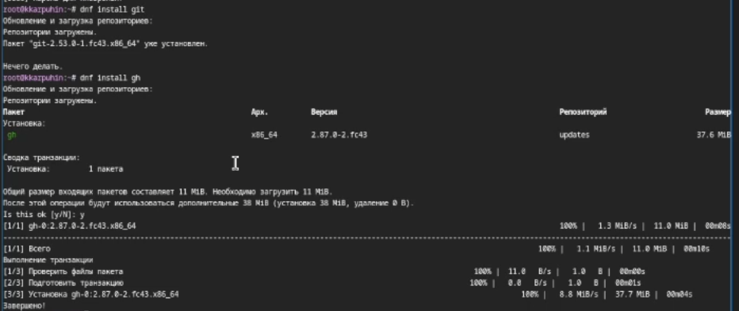
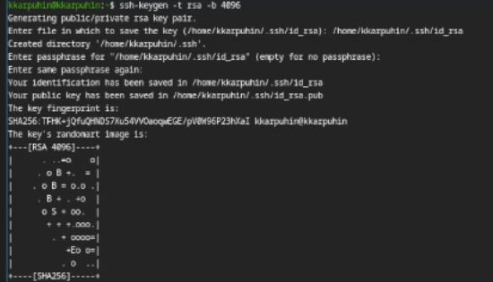
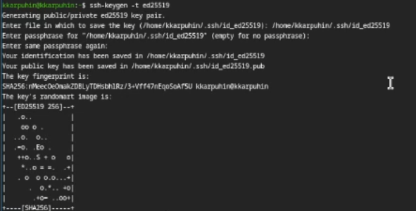
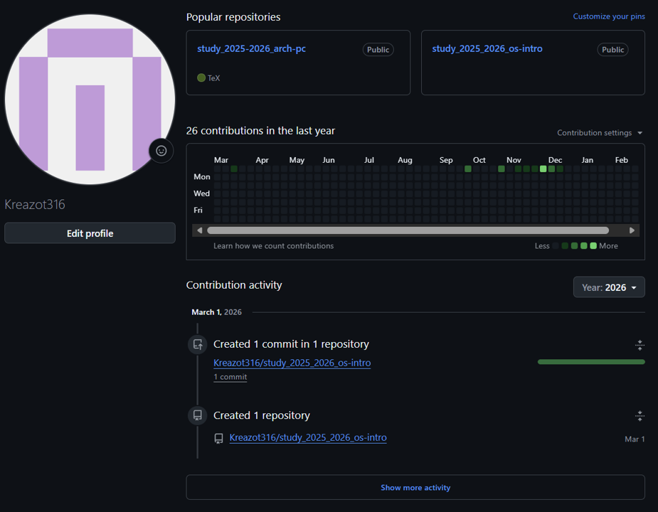
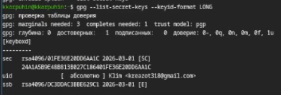
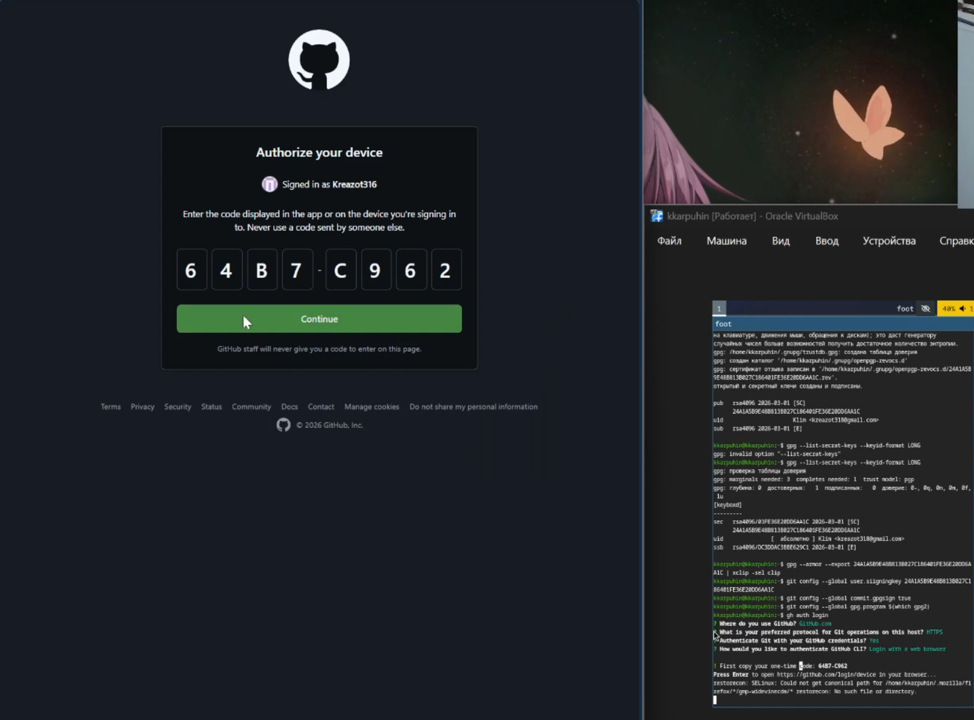
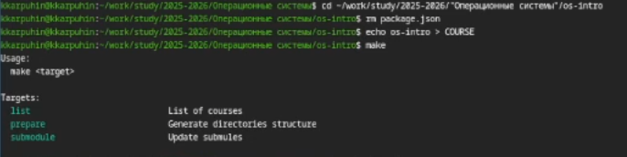

---
## Author
author:
  name: Карпухин Клим
  degrees: 
  orcid: 
  email: 1032255580@rudn.ru
  affiliation:
    - name: Российский университет дружбы народов
      country: Российская Федерация
      postal-code: 117198
      city: Москва
      address: ул. Миклухо-Маклая, д. 6

## Title
title: "Выполнение лабораторной работы №2"
subtitle: "Первоначальная настройка git."
license: "CC BY"
---

# Цель работы

- Изучить идеологиию и применение средств контроля версий.
- Освоить умения по работе с git

# Задание

- Создать базовую конфигурацию для работы с git.
- Создать ключ SSH.
- Создать ключ PGP.
- Настроить подписи git.
- Зарегистрироваться на Github.
- Создать локальный каталог для выполнения заданий по предмету.

# Теоретическое введение

Git - распределённая система контроля версий, предназначенная для отслеживания изменений в файлах и организации совместной работы над проектами. Для безопасного подключения к удалённым репозиториям, например на Github, используются SSH-ключи, обеспечивающие аутентификацию без ввода пароля. Для подтверждения авторства коммитов применяются PGP-ключи (GPG), позволяющие подписывать изменения и делать их проверяемыми. Регистрация на Github даёт возможность удалённого хранения репозиториев и взаимодействия с другими разработчиками. Локальный каталог для выполнения заданий инициализируется как Git-репозиторий, в котором фиксируются все изменения в ходе работы.

# Выполнение лабораторной работы

## Установка программного обеспечения

Установил git и gh([рис. @fig-001]).

{#fig-001 width=70%}

## Базовая настройка Git

Задал имя и email репозитория, настрорил utf-8 в выводе сообщений git, задал имя начальной ветки, настроил параметры autocrlf и safecrlf ([рис. @fig-002]).

{#fig-002 width=70%}

## Создание SSH-ключа

Сгенерировал ключ по алгоритму rsa с ключём размером 4096 бит([рис. @fig-003]).

{#fig-003 width=70%}

Сгенерировал ключ по алгоритму ed25519([рис. @fig-004]).

{#fig-004 width=70%}

## Создание PGP-ключа

Создал ключ PGP([рис. @fig-005]).

{#fig-005 width=70%}

## Настройка Github

Я уже создавал учётную запись Github ранее. В последующих лабараторных работах я продолжу пользоваться ею.([рис. @fig-006]).

{#fig-006 width=70%}

## Добавление PGP ключа в Github

Вывел список ключей ([рис. @fig-007]).

{#fig-007 width=70%}

Скопировал сгенерированный GPG ключ в буфер обмена ([рис. @fig-008]).

{#fig-008 width=70%}

Перешёл в Github, нажал на кнопку *New GPG key* и вставил полученный ключ в поле ввода([рис. @fig-009]).

{#fig-009 width=70%}

## Настройка автоматических подписей коммитов git

Используя введённый email, указал Git применять его при прописи коммитов([рис. @fig-010]).

{#fig-010 width=70%}

## Настройка gh

Авторизация `gh auth login` ([рис. @fig-011]).

{#fig-011 width=70%}

## Шаблон для рабочего пространства

Создал репозиторий курса на основе шаблона([рис. @fig-012]).

{#fig-012 width=70%}

## Настройка каталога курса

Перешёл в каталог курса, удалил лишние файлы, создал необходимые каталоги([рис. @fig-013]).

{#fig-013 width=70%}

Отправил файлы на сервер([рис. @fig-014]).

{#fig-014 width=70%}

# Контрольные вопросы

1.  **Системы контроля версий (VCS)** — это инструменты, отслеживающие изменения в файлах. Они решают задачи сохранения истории проекта, возможности отката к старым верс>
2.  **Хранилище** — это база данных проекта со всей историей. **Коммит** — сохраненный снимок состояния файлов в этот момент. **История** — последовательность таких сним>
3.  В **централизованных** VCS (например, SVN) история хранится на одном сервере. В **децентрализованных** (Git, Mercurial) каждый разработчик имеет полную копию истории>
4.  При единоличной работе вы инициализируете репозиторий, вносите изменения, добавляете их в индекс (`add`), фиксируете (`commit`) и при необходимости просматриваете ис>
5.  При работе с общим хранилищем сначала получают актуальные изменения (`pull`), затем фиксируют свои наработки локально (`commit`), отправляют их на сервер (`push`) и >
6.  Git управляет версиями, позволяет создавать и сливать ветки, гарантирует целостность данных (через хэширование) и обеспечивает высокую скорость работы благодаря лока>
7.  Основные команды: `init` (создать), `clone` (копировать), `add` (подготовить), `commit` (сохранить), `status` (проверить), `log` (история), `pull` (забрать), `push` >
8.  Локально: `git init` → `git add` → `git commit`. С удаленным: `git clone` → `git push` (отправка) и `git pull` (получение обновлений).
9.  **Ветки** — это отдельные линии разработки. Они нужны, чтобы параллельно вести новые функции или исправления ошибок, не затрагивая стабильную версию проекта до их по>
10. Для игнорирования файлов (например, временных, с секретами или зависимостями) используется файл `.gitignore`. Это делается, чтобы не засорять репозиторий мусором и не публиковать конфидециальные данные.

# Выводы

В ходе лабораторной работы была выполнена базовая настройка Git, сгенерированны SSH и PGP ключи для аутентификации и подписи коммитов, а также была произведена регистрация и настройка учётной записи на Github. В результате настроено автоматическое подписание коммитов, что обеспечивает верификацию авторства, и созданно рабочее пространство с использованием шаблона репозитория, подготовленное для дальнейшего выполнения заданий по предмету.

# Список литературы{.unnumbered}

::: {#refs}
:::
