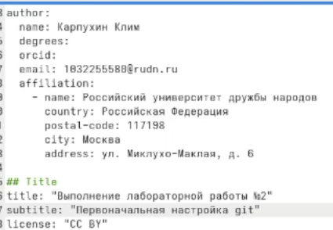
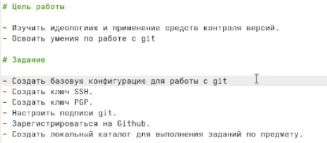
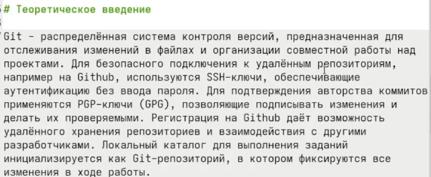
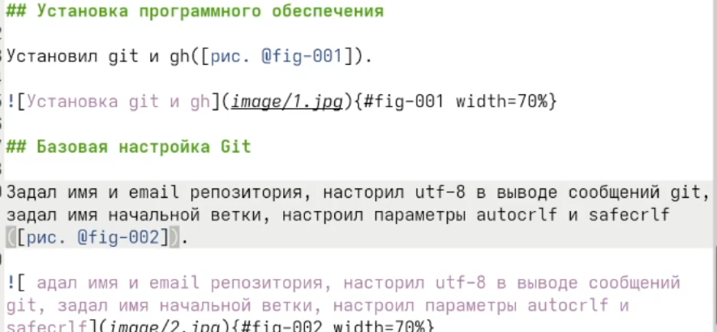
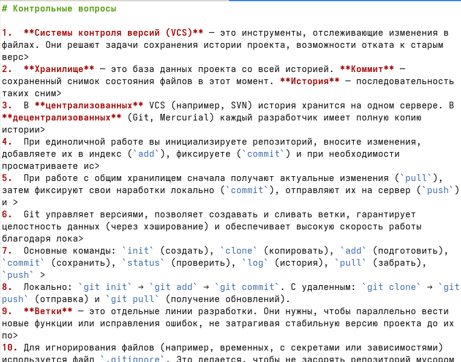
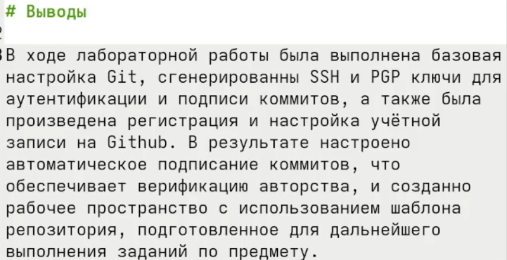
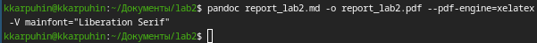

---
## Author
author:
  name: Карпухин Клим
  degrees: 
  orcid: 
  email: 1032255580@rudn.ru
  affiliation:
    - name: Российский университет дружбы народов
      country: Российская Федерация
      postal-code: 117198
      city: Москва
      address: ул. Миклухо-Маклая, д. 6
## Title
title: Выполнение лабораторной работы №3
subtitle: Оформление отчётов с помощью легковесного языка разметки Markdown
license: CC BY
date: 2026-03-01
date-format: "YYYY-MM-DD"
---

# Информация

## Докладчик

:::::::::::::: {.columns align=center}
::: {.column width="65%"}

* **Карпухин Клим**
* Российский университет дружбы народов
* Email: [1032255580@rudn.ru](mailto:1032255580@rudn.ru)
* Роли: студент (лабораторная работа по ОС/виртуализации)
  :::
  ::: {.column width="35%"}
  {width=90%}
  :::
  ::::::::::::::

# Вводная часть

## Актуальность

- Markdown - один из самых популярных языков разметки для оформления технической  документации и отчётов
- Умение быстро и качественно оформлять отчёты необходимо в учебной и научной деятельности
- Инструменты (pandoc) позволяют автоматически преобразовывать Markdown в различные форматы (pdf, docx, html)

## Объект и предмет исследования

- **Объект:** процесс оформления отчётов по лабораторным работам
- **Предмет:** язык разметки Markdown и инструменты его обработки (Pandoc)

## Научная новизна

- Освоение современных инструментов автоматизации создания отчётов
- Применение подхода "единый источник" для генерации документов в разных форматах

## Практическая значимость работы

- Полученные навыки позволяют существенно ускорить подготовку отчётов по другим дисциплинам
- Возможность создавать документы, которые легко конвертировать в требуемый формат

## Цели и задачи

**Цель:** 
Научиться оформлять отчёты с помощью легковесного языка разметки Markdown.

**Задачи:** 
1. Подготовить отчёт по предыдущей лабораторной работе в формате Markdown
2. Скомпилировать отчёт в форматы pdf, docx и предоставить архив с исходниками.


## Материалы и методы

- Язык разметки **Markdown**
- Конвертер документов **Pandoc**
- Фильтры: `pandoc-crossred` для нумерации рисунков и формул
- Система сборки **Make** (Makefile)
- Целевые форматы: **pdf** (Через LaTeX) и **docx**

# Содержание исследования

## Этапы выполнения работы

1. Создание шаблона отчёта в Markdown с титульным листом, теоретическим введением, ходом работы и выводами.
2. Вставка скриншотов, демонстрирующих процесс выполнения лабораторной работы.
3. Ответы на контрольные вопросы.
4. Компиляция отчёта в pdf и word с помощью Pandoc.
5. Автоматизация процесса с помощью Makefile.

## Базовые элементы Markdown

-**Заголовки:** `#`, `##`, `###`
-**Выделение текста:** `**жирный**`, `*курсив*`, `***жирный курсив***`
-**Списки:** маркированные (`-`) и нумерованные (`1.`)
-**Ссылки:** `[текст](ссылка)`
-**Вставка изображений:** ``
-**Формулы:** внутристрочные (`$...$`) и выключенные (`$$...$$`)
-**Блоки кода:** с подсветкой синтаксиса


## Пример использования формул

$$
\sin^2 (x) + \cos^2 (x) = 1
$$ {#eq:eq:sin2+cos2}

Ссылка на формулу ([-@eq:eq:sin2+cos2]).

## Скриншоты процесса

{#fig-001 width=60%}

{#fig-002 width=60%}

{#fig-003 width=60%}

{#fig-004 width=60%}

{#fig-005 width=60%}

{#fig-006 width=60%}

{#fig-007 width=60%}


# Результаты

## Makefile для автоматизации сборки

```
FILES = $(patsubst %.md, %.docx, $(wildcard *.md))
FILES += $(patsubst %.md, %.pdf, $(wildcard *.md))

LATEX_FORMAT =

FILTER = --filter pandoc-crossref

%.docx: %.md
-pandoc "$<" $(FILTER) -o "$@"

%.pdf: %.md
-pandoc "$<" $(LATEX_FORMAT) $(FILTER) -o "$@"

all: $(FILES)
@echo $(FILES)

clean:
-rm $(FILES) *~
```

# Анализ и практичесская значимость

- Создан полноценный отчёт по предыдущей лабораторной работе в Markdown
- Освоены приёмы вставки изображений, формул, листингов
- Настроена автоматическая сборка отчёта в pdf и docx
- Получены навыки, необходимые для подготовки курсовых и дипломных работ

# Заключение

## Выводы

- В ходе лабораторной работы я научился оформлять отчёты с помощью языка разметки Markdown.
- Познакомился с возможностями Pandoc по конвертации Markdown-документов в различные форматы.
- Приобрёл опыт использования Makefile для автоматизации сборки.
= Полученнын компетенции будут полезны в дальнейшей учебной и научной деятельности.
