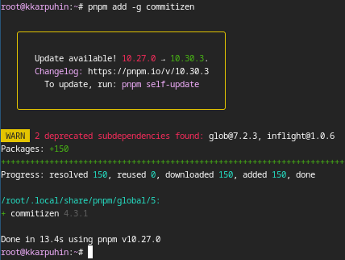
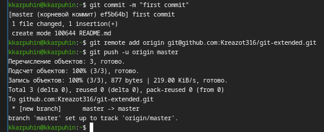
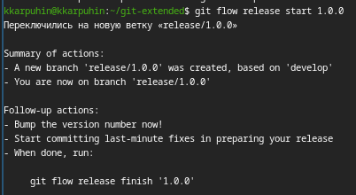
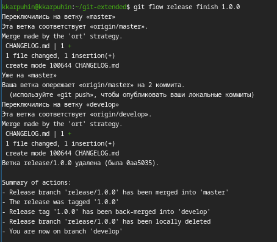

---
## Author
author:
  name: Карпухин Клим
  degrees: ""
  orcid: ""
  email: 1032255580@rudn.ru
  affiliation:
    - name: "Российский университет дружбы народов"
      country: "Российская Федерация"
      postal-code: 117198
      city: "Москва"
      address: "ул. Миклухо-Маклая, д. 6"
## Title
title: "Выполнение лабораторной работы №4"
subtitle: "Продвинутое использование git"
license: "CC BY"
date: 2026-03-07
date-format: "YYYY-MM-DD"
slide_level: 2

format:
  beamer:
    classoption: "aspectratio=169"
    pdf-engine: xelatex
    number-sections: false
    toc: false
    keep-tex: true

mainfont: "DejaVu Serif"
monofont: "DejaVu Sans Mono"
sansfont: "DejaVu Sans"
---

# Содержание

1. Информация о докладчике
2. Вводная часть и актуальность
3. Объект и предмет исследования
4. Научная новизна и практическая значимость
5. Цель, гипотеза и задачи
6. Материалы, методы и инструменты
7. Ход работы (этапы, скриншоты)
8. Результаты и анализ
9. Выводы

# Информация

## Докладчик

::: {.columns align="center"}
::: {.column width="65%"}

* **Карпухин Клим**
* Российский университет дружбы народов
* Email: [1032255580@rudn.ru](mailto:1032255580@rudn.ru)
* Роли: студент (лабораторная работа по ОС/виртуализации)

:::
::: {.column width="35%"}
{width="90%"}
:::
:::

# Вводная часть

## Актуальность

* Современная разработка программного обеспечения требует чёткой организации веток, релизов и истории изменений. Gitflow решает эту задачу.
* Семантическое версионирование и общепринятые коммиты облегчают автоматизацию выпуска версий и генерации журналов изменений.
* Владение такими инструментами делает процесс разработки прозрачным и воспроизводимым, что важно и в учебных, и в реальных проектах.

## Объект и предмет исследования

* **Объект:** процесс управления репозиторием программного проекта с использованием системы контроля версий git.
* **Предмет:** методология Gitflow, семантическое версионирование (SemVer) и спецификация Conventional Commits, а также инструменты commitizen и standard-changelog.

# Научная новизна и практическая значимость

## Научная новизна

* Интеграция Gitflow, SemVer и Conventional Commits в единый практический сценарий на учебном репозитории.
* Использование стандартизированных сообщений коммитов как источника данных для автоматической генерации CHANGELOG.
* Формирование практических навыков, необходимых для внедрения промышленного процесса релизов даже в небольших учебных проектах.

## Практическая значимость работы

* Освоенные подходы позволяют эффективно управлять ветками feature, release и hotfix в реальных командах разработки.
* Автоматическая генерация журналов изменений и релизов снижает количество ручной работы и ошибок при подготовке версий.
* Полученные навыки можно напрямую перенести в курсовые, дипломные и практические проекты с использованием GitHub.

# Цель, гипотеза и задачи

## Цель

Получить устойчивые навыки корректной работы с репозиториями git на основе методологии Gitflow и практик семантического версионирования и общепринятых коммитов.

## Гипотеза

Если применить Gitflow, SemVer и Conventional Commits в учебном репозитории, то процесс разработки и выпуска версий станет более структурированным и прозрачным.

## Задачи

* Установить и настроить инструменты git-flow, Node.js, pnpm, commitizen и standard-changelog.
* Создать и настроить репозиторий git-extended на GitHub.
* Преобразовать репозиторий в репозиторий git-flow и настроить conventional commits.
* Реализовать практический сценарий: разработка новой функциональности и выпуск релизов 1.0.0 и 1.2.3.

# Материалы и методы

## Материалы и методы

* **Инструменты:**
  * Система контроля версий **git**, расширение **git-flow** для поддержки Gitflow Workflow.
  * Платформа **GitHub** для хранения и публикации репозитория git-extended.
  * Среда **Node.js** и менеджер пакетов **pnpm** для установки commitizen и standard-changelog.
  * Спецификация **Semantic Versioning (SemVer)** и **Conventional commits** как теоретическая база структурирования версий и коммитов.

# Ход работы — подготовка и настройка инструментов

## Этап 1: Установка git-flow и настройка репозитория

* Установка git-flow из коллекции репозиториев copr.

{#fig-001 width="30%"}

## Этап 2: Настройка Node.js и pnpm

* Конфигурация Node.js и pnpm, добавление каталога с исполняемыми файлами в переменную PATH.

{#fig-002 width="30%"}

## Этап 3: Установка commitizen и standard-changelog

* Установка глобальных пакетов для форматирования коммитов и генерации логов.

{#fig-003 width="30%"}
{#fig-004 width="30%"}

## Этап 4: Создание репозитория на GitHub

* Создание репозитория git-extended на GitHub.

{#fig-005 width="30%"}

## Этап 5: Первый коммит и отправка на GitHub

* Создание первого коммита и отправка его на GitHub.

{#fig-006 width="30%"}

# Ход работы — реализация сценария Gitflow

## Этап 6: Инициализация git-flow

* Преобразование репозитория в репозиторий git-flow.

## Этап 7: Создание релиза 1.0.0

* Создание релиза с версией 1.0.0.

{#fig-016 width="30%"}

## Этап 8: Генерация журнала изменений

* Создание журнала изменений с помощью standard-changelog.

{#fig-017 width="30%"}

## Этап 9: Завершение релиза

* Отправка релизной ветки в основную ветку и публикация релиза на GitHub.

{#fig-019 width="30%"}

## Этап 10: Создание релиза 1.2.3

* Повторение цикла для версии 1.2.3 (добавление новой функциональности).

# Результаты и анализ

## Анализ достигнутых результатов

* Реализован полный цикл Gitflow: от создания функциональных веток до релизов и горячих исправлений.
* Сообщения коммитов приведены к единому формату, что позволило автоматически форматировать CHANGELOG.
* Репозиторий стал удобен для отслеживания истории и выпуска версий, что подтверждается успешно созданными релизами 1.0.0 и 1.2.3.

## Практическая значимость результатов

* Полученный опыт можно использовать при разработке учебных и реальных проектов с командной работой и релизным циклом.
* Набор инструментов (git-flow, commitizen, standard-changelog) масштабируется на более крупные системы без существенных изменений процесса.
* Сформированные навыки лягут в основу более сложных практик DevOps и CI/CD.

# Выводы

## Общее заключение

* В ходе лабораторной работы освоены методология Gitflow, семантическое версионирование и стандарт общепринятых коммитов, а также инструменты commitizen и standard-changelog.
* Практически отработаны сценарии создания функциональных веток, подготовки релизов и автоматической генерации журналов изменений.
* Достигнутая цель подтверждает гипотезу о том, что применение данных практик делает процесс разработки более структурированным и прозрачным.

## Выводы

1. Gitflow обеспечивает удобную и понятную структуру веток для релизно-ориентированной разработки.
2. Семантическое версионирование и Conventional Commits упрощают сопровождение проекта и взаимодействие участников команды.
3. Автоматизация формирования CHANGELOG и релизов снижает вероятность ошибок и ускоряет выпуск новых версий.
4. Полученные компетенции полезны для последующей учебной, исследовательской и профессиональной деятельности в области разработки ПО.
