---
## Author
author:
  name: Карпухин Клим
  degrees: 
  orcid: 
  email: 1032255580@rudn.ru
  affiliation:
    - name: Российский университет дружбы народов
      country: Российская Федерация
      postal-code: 117198
      city: Москва
      address: ул. Миклухо-Маклая, д. 6

## Title
title: "Выполнение лабораторной работы №4"
subtitle: "Продвинутое использование git."
license: "CC BY"
---

# Цель работы

Получение навыков правильной работы с репозиториями git.

# Задание

1. Выполнить работу тестового репозитория.
2. Преобразовать рабочий репозиторий в репозиторий git-flow и conventional commits.

# Теоретическое введение

Gitflow Workflow использует две основные ветки: master (история релизов) и develop (интеграция новых функций). От них создаются feature-ветки для новых возможностей, release-ветки для подготовки релиза и hotfix-ветки для срочных исправлений. Семантическое версионизирование задаёт формать MAJOR.MINOR.PATCH, где: 
- MAJOR означают несовместимые изменения API, 
- MINOR - добавление обратно совместимых функций, 
- PATCH - исправления.

Общепринятые коммиты стандартизируют сообщения коммитов с типами (feat, fix и др.), а наличие BREAKING CHANGE указывает на мажорное изменение. Для автоматизации используются git-flow (ветвление), commitizen (коммиты по стандарту) и standart-changelog (генерация CHANGELOG).

# Выполнение лабораторной работы

## Установка программного обеспечения

Установил git-flow из коллекции репозиториев corp([рис. @fig-001]).

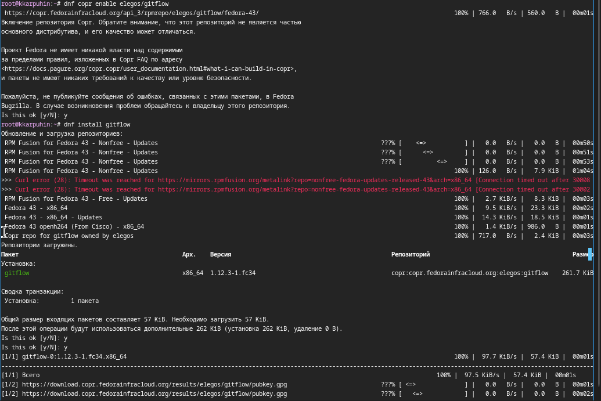{#fig-001 width=70%}

Установил nodejs и pnpm командами `dnf install nodejs` и `dnf install pnpm`. Добавил каталог с исполняемыми файлами, устанавлиевыми yarn, в переменную PATH([рис. @fig-002]).

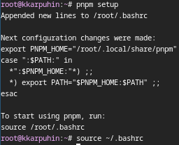{#fig-002 width=70%}

Добавил программу для помощи в форматировании коммитов **commitizen**([рис. @fig-003]).

{#fig-003 width=70%}

Добавил программу для помощи в создании логов **standard-changelog**([рис. @fig-004]).

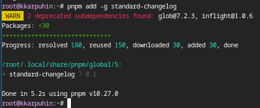{#fig-004 width=70%}

## Практический сценарий использования git

Создал репозиторий на Github под названием git-extended([рис. @fig-005]).

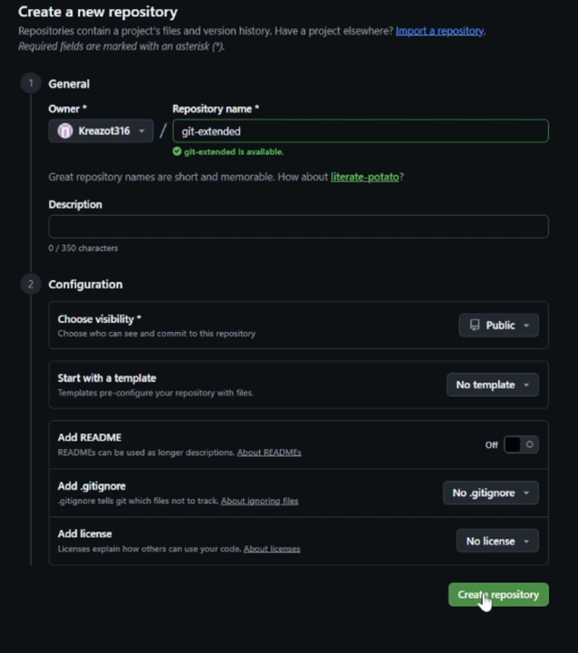{#fig-005 width=70%}

Сделал первый коммит и выложил его на Github([рис. @fig-006]).

{#fig-006 width=70%}

Вывел код конфигурационного файла пакетов Node.js в консоль([рис. @fig-007]).

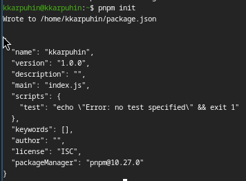{#fig-007 width=70%}

Измененил название и лицензию пакета, добавил комманду для форматирования коммитов([рис. @fig-008]).

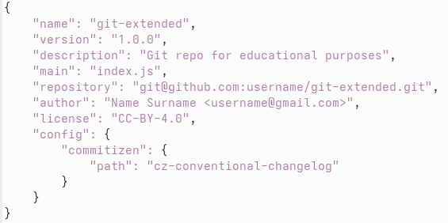{#fig-008 width=70%}

Добавил новые файлы через `git add .`([рис. @fig-009]).

{#fig-009 width=70%}

Выполнил коммит через `git cz`([рис. @fig-010]).

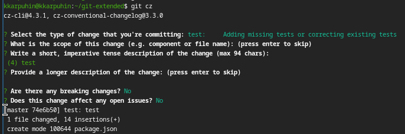{#fig-010 width=70%}

Отправил изменения на Github([рис. @fig-0011]).

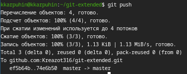{#fig-011 width=70%}

Инициализировал git-flow([рис. @fig-012]).

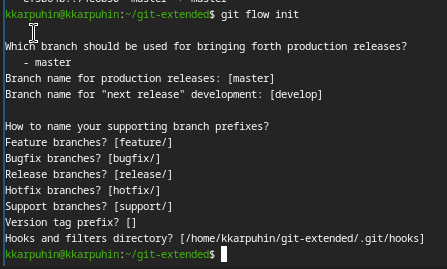{#fig-012 width=70%}

Проверил, нахожусь ли я на ветке develop([рис. @fig-013]).

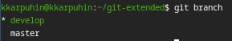{#fig-013 width=70%}

Загрузил весь репозиторий в хранилище([рис. @fig-014]).

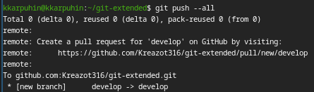{#fig-014 width=70%}

Установил внешнюю ветку как вышестоящую для этой ветки([рис. @fig-015]).

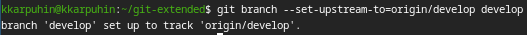{#fig-015 width=70%}

Создал релиз с версией 1.0.0([рис. @fig-016]).

{#fig-016 width=70%}

Создал журнал изменений([рис. @fig-017]).

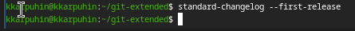{#fig-017 width=70%}

Добавил журнал изменений в индекс([рис. @fig-018]).

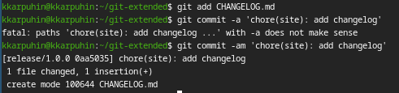{#fig-018 width=70%}

Отправил релизную ветку в основную ветку([рис. @fig-019).

{#fig-019 width=70%}

Отправил данные на github коммандами `git push --all` и `git push --tags`. Создал релиз на github коммадной `gh release create v1.0.0 -F CHANGELOG.md`

## Работа с репозиторием git

Создал ветку для новой функциональности([рис. @fig-020]).

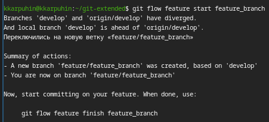{#fig-020 width=70%}

Объединил ветку feature_branch с develop([рис. @fig-021]).

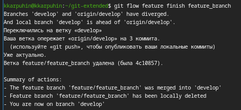{#fig-021 width=70%}

Создал релиз с версией 1.2.3([рис. @fig-022]).

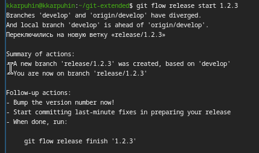{#fig-022 width=70%}

Поменял номер версии в файле package.json на 1.2.3([рис. @fig-023]).

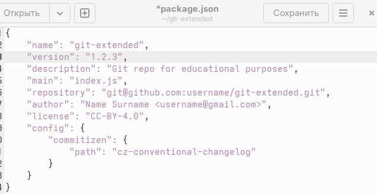{#fig-023 width=70%}

Создал журнал изменений([рис. @fig-024]).

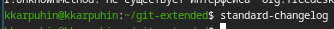{#fig-024 width=70%}

Добавил журнал изменений в индекс([рис. @fig-025]).

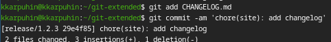{#fig-025 width=70%}

Отправил релизную ветку в основную ветку([рис. @fig-026]).

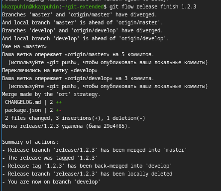{#fig-026 width=70%}

Отправил данные на github([рис. @fig-027]).

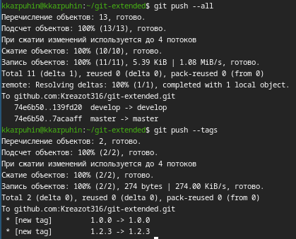{#fig-027 width=70%}

Создал релиз на github с комментарием из журнала изменений([рис. @fig-028]).

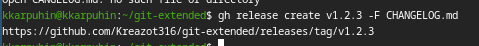{#fig-028 width=70%}

# Выводы

В результате работы освоены методология Gitflow, семантическое версионирование и стантарт общепринятых коммитов, а также инструменты автоматизации commitzen и standard-changelog. Полученные навыки позволяют эффективно управлять репозиториями и обеспечивать прозрачность процесса разработки.

# Список литературы{.unnumbered}

::: {#refs}
:::
