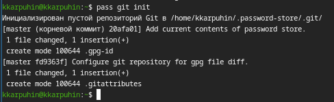
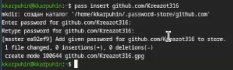
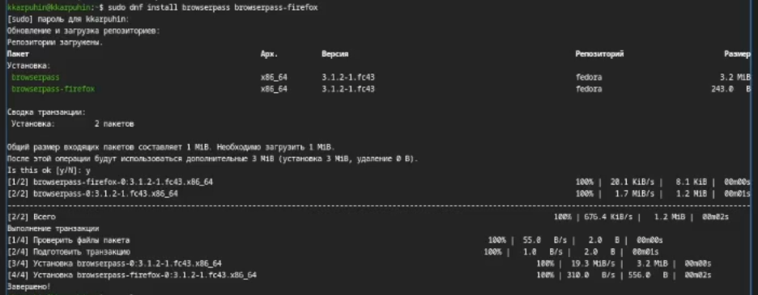
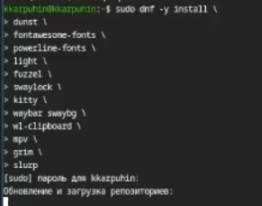
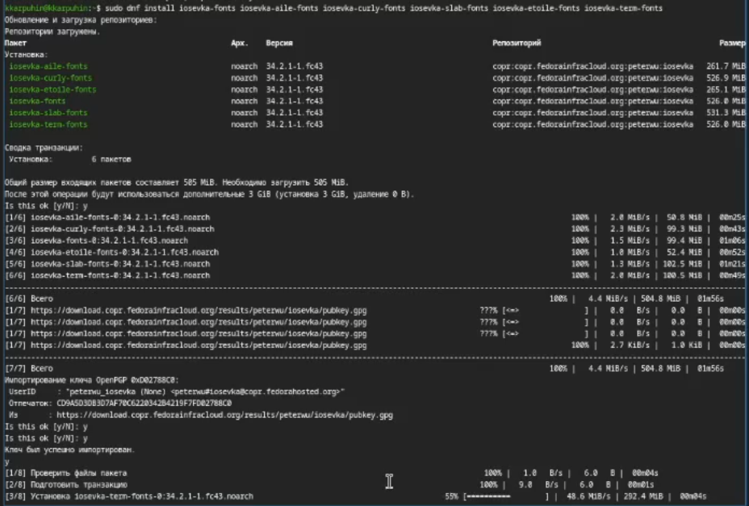
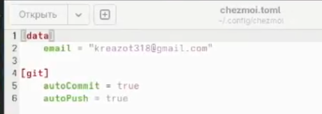

---
## Author
author:
  name: Карпухин Клим
  degrees: ""
  orcid: ""
  email: 1032255580@rudn.ru
  affiliation:
    - name: "Российский университет дружбы народов"
      country: "Российская Федерация"
      postal-code: 117198
      city: "Москва"
      address: "ул. Миклухо-Маклая, д. 6"
## Title
title: "Выполнение лабораторной работы №4"
subtitle: "Продвинутое использование git"
license: "CC BY"
date: 2026-03-07
date-format: "YYYY-MM-DD"
slide_level: 2

format:
  beamer:
    classoption: "aspectratio=169"
    pdf-engine: xelatex
    number-sections: false
    toc: false
    keep-tex: true

mainfont: "DejaVu Serif"
monofont: "DejaVu Sans Mono"
sansfont: "DejaVu Sans"
---

# Содержание

1. Информация о докладчике
2. Вводная часть и актуальность
3. Объект и предмет исследования
4. Научная новизна и практическая значимость
5. Цель, гипотеза и задачи
6. Материалы, методы и инструменты
7. Ход работы (этапы, скриншоты)
8. Результаты и анализ
9. Выводы

# Информация

## Докладчик

::: {.columns align="center"}
::: {.column width="65%"}

* **Карпухин Клим**
* Российский университет дружбы народов
* Email: [1032255580@rudn.ru](mailto:1032255580@rudn.ru)
* Роли: студент (лабораторная работа по ОС/виртуализации)

:::
::: {.column width="35%"}
{width="90%"}
:::
:::

# Вводная часть

## Актуальность

- Современные специалисты ежедневно работают с множеством учётных записей и конфигурационных файлов. Безопасное хранение паролей и управление настройками рабочей среды — критически важные задачи.
- Инструменты pass (менеджер паролей) и chezmoi (управление dotfiles) позволяют решить эти задачи сиспользованием проверенных криптографических методов (GPG) и систем контроля версий (Git).
- Синхронизация паролей и конфигураций между несколькими машинами становится простой и надёжной, что особенно актуально для разработчиков и администраторов.

## Объект и предмет исследования

- **Объект:** процесс безопасного хранения учётных данных и управления конфигурационными файлами в Unix-подобных операционных системах.
- **Предмет:** менеджер паролей `pass`, его расширения (`gopass`, `browserpass`), система управления dotfiles `chezmoi`, а также технологии GPG и Git как основа для их работы.

# Научная новизна и практическая значимость

## Научная новизна

- Интеграция GPG-шифрования с файловой системой для организации иерархического хранилища паролей.
- Использование Git для версионирования и синхронизации зашифрованных данных без раскрытия их содержимого.
- Применение шаблонов (Go templates) в `chezmoi` для адаптации конфигураций под различные машины в рамках единого репозитория dotfiles.

## Практическая значимость работы

- Полученные навыки позволяют организовать единое безопасное хранилище паролей, доступное с любого устройства, и автоматически разворачивать рабочее окружение на новых машинах.
- Снижение риска потери или компрометации паролей за счёт шифрования и резервного копирования через Git.
- Ускорение настройки новых рабочих мест и упрощение поддержки существующих конфигураций.

# Цель, гипотеза и задачи

## Цель

Освоить работу с менеджером паролей `pass` и системой управления файлами конфигурации `chezmoi`. Получить навыки безопасного хранения паролей, синхронизации их через Git, а также управления конфигурационными файлами на нескольких машинах.

## Гипотеза

Применение `pass` и `chezmoi` позволит значительно повысить безопасность и воспроизводимость рабочей среды, упростив её перенос между устройствами.

## Задачи

- Установить и настроить менеджер паролей `pass` и его расширение `gopass`.
- Сгенерировать GPG-ключ и инициализировать хранилище паролей.
- Подключить удалённый Git-репозиторий для синхронизации хранилища.
- Установить браузерное расширение `browserpass` для удобного использования паролей.
- Установить `chezmoi` и создать собственный репозиторий dotfiles на основе шаблона.
- Протестировать управление конфигурацией на локальной машине и развернуть её на другой системе.

# Материалы и методы

- **Инструменты:**
  - Менеджер паролей **pass** (стандартный менеджер паролей Unix).
  - Расширенная версия **gopass** (с дополнительными возможностями).
  - Криптографическая система **GPG** для шифрования паролей.
  - Система контроля версий **Git** и платформа **GitHub** для синхронизации.
  - Браузерное расширение **browserpass** для интеграции с браузером.
  - Инструмент управления dotfiles **chezmoi**.
  - Редактор и утилиты командной строки (установка шрифтов, бинарных файлов).

# Ход работы 

## Этап 1: Установка pass и gopass

* Установка менеджера паролей `pass` из репозитория.

{#fig-001 width="30%"}

* Установка расширенной версии `gopass`.

{#fig-002 width="30%"}

## Этап 2: Настройка GPG и инициализация хранилища

* Просмотр существующих GPG-ключей.

{#fig-003 width="30%"}

* Инициализация хранилища паролей с использованием выбранного ключа.

{#fig-004 width="30%"}

## Этап 3: Синхронизация через Git

* Создание Git-структуры внутри хранилища.

{#fig-005 width="30%"}

* Привязка удалённого репозитория на GitHub.

{#fig-006 width="30%"}

## Этап 4: Добавление пароля и настройка browserpass

* Добавление нового пароля в хранилище.

{#fig-008 width="30%"}

* Настройка интерфейса для взаимодействия с браузером (browserpass).

{#fig-007 width="30%"}

# Ход работы — установка и настройка chezmoi

## Этап 5: Установка chezmoi и создание репозитория dotfiles

* Установка дополнительного ПО (chezmoi, шрифты, бинарные файлы).

{#fig-009 width="30%"}
{#fig-010 width="30%"}

* Создание собственного репозитория dotfiles с помощью утилит chezmoi.

{#fig-012 width="30%"}

## Этап 6: Подключение репозитория и работа на другой машине

* Подключение созданного репозитория к текущей системе.

{#fig-013 width="30%"}

* На второй машине инициализация chezmoi с тем же репозиторием dotfiles.

{#fig-014 width="30%"}

* Добавление параметров autoCommit и autoPush в конфигурацию для автоматической синхронизации.

{#fig-015 width="30%"}

# Результаты и анализ

## Анализ достигнутых результатов

- Создано зашифрованное хранилище паролей на базе `pass`, инициализировано с GPG-ключом и связано с удалённым Git-репозиторием.
- Пароли успешно добавляются, извлекаются и синхронизируются между устройствами.
- Настроено браузерное расширение `browserpass`, позволяющее автоматически подставлять пароли на веб-сайтах.
- С помощью `chezmoi` создан репозиторий dotfiles, который развёрнут на двух машинах; конфигурация автоматически применяется и отслеживается через Git.

## Практическая значимость результатов

- Полученная инфраструктура обеспечивает высокий уровень безопасности учётных данных и лёгкость восстановления окружения при смене оборудования.
- Навыки работы с `chezmoi` позволяют эффективно поддерживать единообразие конфигураций в команде или на личных устройствах.
- Достигнутая автоматизация (autoCommit/autoPush) минимизирует ручные операции при изменении конфигураций.

# Выводы

## Общее заключение

- В ходе лабораторной работы освоены современные инструменты для безопасного хранения паролей (`pass`, `gopass`) и централизованного управления конфигурационными файлами (`chezmoi`).
- На практике опробованы: генерация и использование GPG-ключей, инициализация и синхронизация хранилища паролей через Git, интеграция pass с браузером, создание собственного репозитория dotfiles, применение шаблонов и работа с chezmoi на нескольких машинах.
- Цель работы достигнута, гипотеза подтверждена: использование данных инструментов делает рабочую среду безопаснее и воспроизводимее.

## Выводы

1. Менеджер паролей `pass` в сочетании с Git и GPG предоставляет простое, но надёжное решение для хранения и синхронизации паролей.
2. Расширение `browserpass` существенно упрощает повседневное использование паролей в браузере.
3. `Chezmoi` эффективно решает задачу управления dotfiles благодаря шаблонам и интеграции с Git.
4. Автоматическая фиксация и отправка изменений (autoCommit/autoPush) снижают риск рассинхронизации конфигураций.
5. Полученные компетенции могут быть непосредственно применены в учебной, научной и профессиональной деятельности для организации безопасной и переносимой рабочей среды.
