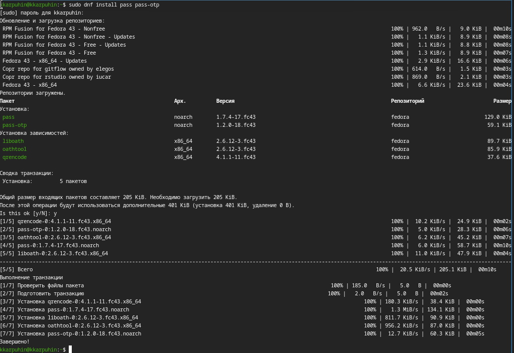
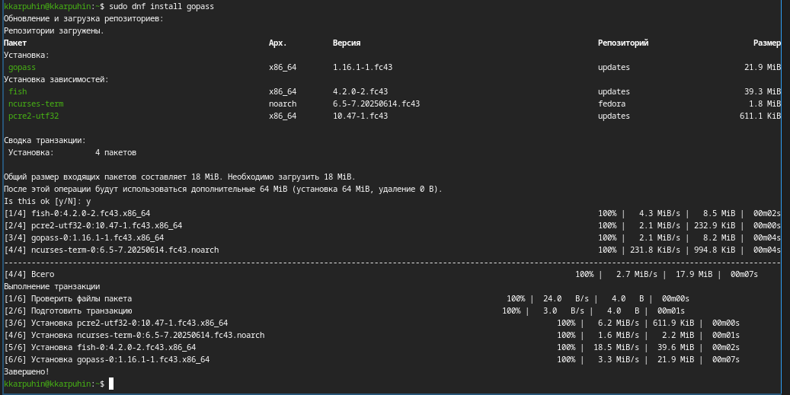
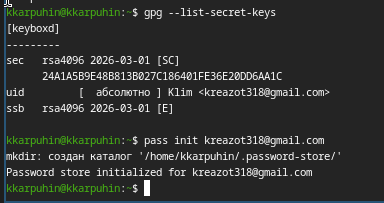
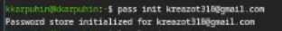
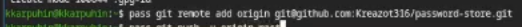
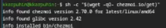
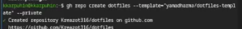
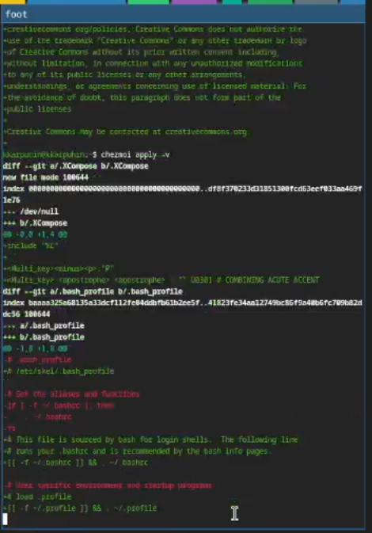
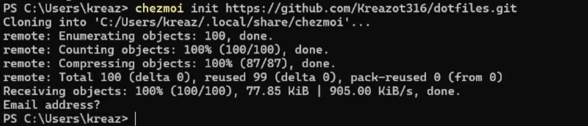

---
## Author
author:
  name: Карпухин Клим
  degrees: 
  orcid: 
  email: 1032255580@rudn.ru
  affiliation:
    - name: Российский университет дружбы народов
      country: Российская Федерация
      postal-code: 117198
      city: Москва
      address: ул. Миклухо-Маклая, д. 6

## Title
title: "Выполнение лабораторной работы №5"
subtitle: "Настройка рабочей среды."
license: "CC BY"
---

# Цель работы

Освоение работы с менеджером паролей зфыы и системой управления файлами конфигурации chezmoi. Получение навыков безопасного хранения паролей, синхронизации их через Git, а также управления конфигурационными файлами на нескольких машинах.

# Задание

1. Установить и настроить менеджер паролей pass.
2. Инициализировать хранилище паролей, привязать к нему GPG-ключ.
3. Настроить синхронизацию хранилища паролей через Git.
4. Установить и настроить браузерное расширение browserpass для удобного использования паролей в браузере.
5. Установить chezmoi и создать собственный репозиторий dotfiles на основе готового шаблона.
6. Протестировать управление конфигурацией на локальной машине и затем развернуть конфигурацию на другой системе.

# Теоретическое введение

**Менеджер паролей pass** (The standard Unix password manager) хранит пароли в зашифрованном виде в файловой системе, используя GPG-ключи. Пароли организованы в виде иерархии каталогов и файлов. База может синхронизироваться через Git, что позволяет использовать её на нескольких устройствах. Существуют графические интерфейсы (qtpass) и браузерные расширения (browserpass), облегчающие повседневное использование.

Структура базы паролей может быть произвольной, но для совместной работы с дополнительным ПО рекомендуется придерживаться семантических соглашений: например, имена файлов вида `user@example.com:22.gpg` или каталогов `example.com/user.gpg`. Это позволяет программам автоматически извлекать нужные поля.

**Chezmoi** — инструмент для управления персональными конфигурационными файлами (dotfiles). Он хранит исходные файлы в собственном каталоге (`~/.local/share/chezmoi`) и позволяет применять их к домашнему каталогу с учётом особенностей конкретной машины. Основные возможности: использование шаблонов (синтаксис Go templates), поддержка разных форматов конфигурации (TOML, JSON, YAML), интеграция с Git, автоматическая фиксация изменений. С помощью шаблонов можно создавать файлы, которые варьируются от машины к машине (например, `~/.bashrc` с разными настройками для рабочего и домашнего компьютера).

# Выполнение лабораторной работы

## Установка программного обеспечения

### Установка

Установил `pass`([рис. @fig-001]).

{#fig-001 width="70%"}

Установил `gopass` ([рис. @fig-002]).

{#fig-002 width="70%"}

### Настройка

Просмотрел список ключей, нашёл действующий ключ ([рис. @fig-003]).

{#fig-003 width="70%"}

Инициализировал хранилище ([рис. @fig-004]).

{#fig-004 width="70%"}

Создал структуру git([рис. @fig-005]).

{#fig-005 width="70%"}

Задал адрес репозитория на хостинге ([рис. @fig-006]).

{#fig-006 width="70%"}

Настроил иинтерфейс для взаимодействия с браузером ([рис. @fig-007]).

{#fig-007 width="70%"}

### Сохранение пароля

Добавил новый пароль ([рис. @fig-008]).

{#fig-008 width="70%"}

### Дополнительное программное обеспечение

Установил дополнительное программное обеспечение ([рис. @fig-009]).

{#fig-009 width="70%"}

Установил шрифты ([рис. @fig-010]).

{#fig-010 width="70%"}

Установил бинарный файл ([рис. @fig-011]).

{#fig-011 width="70%"}

Создал собственный репозиторий с помощью утилит([рис. @fig-012]).

{#fig-012 width="70%"}

Подключил репозиторий к своей системе ([рис. @fig-013]).

{#fig-013 width="70%"}

На второй машине  инициализировал `chezmoi` с репозиторием `dotfiles`([рис. @fig-014]).

{#fig-014 width="70%"}

Добавил в файл конфигурации `~/.config/chezmoi/chezmoi.toml` autoCommit и autoPush([рис. @fig-015]).

{#fig-015 width="70%"}

# Выводы

В результате выполнения лабораторной работы были освоены современные инструменты для безопасного хранения паролей (pass) и централизованного управления конфигурационными файлами (chezmoi). На практике опробованы:

- генерация и использование GPG-ключей;
- инициализация и синхронизация хранилища паролей через Git;
- интеграция pass с браузером через browserpass;
- создание собственного репозитория dotfiles на основе шаблона;
- применение шаблонов для адаптации конфигурации под разные машины;
- работа с cehmzoi на нескольких машинах.

Полученные навыки позволяют значительно повысить эффективность и безопасность администрирования рабочей среды, а также обеспечить её воспроизводимость на новых устройствах.

# Список литературы{.unnumbered}

::: {#refs}
:::