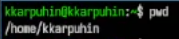
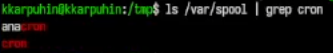
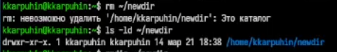
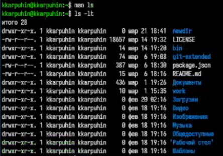

---
## Author
author:
  name: Карпухин Клим
  degrees: ""
  orcid: ""
  email: 1032255580@rudn.ru
  affiliation:
    - name: "Российский университет дружбы народов"
      country: "Российская Федерация"
      postal-code: 117198
      city: "Москва"
      address: "ул. Миклухо-Маклая, д. 6"
## Title
title: "Выполнение лабораторной работы №6"
subtitle: "Основы интерфейса взаимодействия пользователя с системой Unix на уровне командной строки."
license: "CC BY"
date: 2026-03-21
date-format: "YYYY-MM-DD"
slide_level: 2

format:
  beamer:
    classoption: "aspectratio=169"
    pdf-engine: xelatex
    number-sections: false
    toc: false
    keep-tex: true

mainfont: "DejaVu Serif"
monofont: "DejaVu Sans Mono"
sansfont: "DejaVu Sans"
---

# Содержание

1. Информация о докладчике
2. Вводная часть и актуальность
3. Объект и предмет исследования
4. Научная новизна и практическая значимость
5. Цель, гипотеза и задачи
6. Материалы, методы и инструменты
7. Ход работы (этапы, скриншоты)
8. Результаты и анализ
9. Выводы

# Информация

## Докладчик

::: {.columns align="center"}
::: {.column width="65%"}

* **Карпухин Клим**
* Российский университет дружбы народов
* Email: [1032255580@rudn.ru](mailto:1032255580@rudn.ru)
* Роли: студент (лабораторная работа по ОС/виртуализации)

:::
::: {.column width="35%"}
{width="90%"}
:::
:::

# Вводная часть

## Актуальность

- Командная строка остаётся одним из основных инструментов работы в Linux, особенно при администрировании, разработке и настройке системы.
- Умение работать с каталогами, файлами, справкой `man` и историей команд позволяет быстрее и точнее выполнять типовые операции без графического интерфейса.
- Освоение базовых команд `cd`, `pwd`, `ls`, `mkdir`, `rmdir`, `rm`, `history` формирует фундамент для дальнейшего изучения Unix-подобных систем.
- Работа в Fedora Sway особенно хорошо демонстрирует, что даже в современном  графическом окружении терминал остаётся незаменимым инструментом.

## Объект и предмет исследования

* **Объект:** процесс взаимодействия пользователя с операционной системой Linux через командную строку.
* **Предмет:** базовые команды оболочки Unix/Linux, применяемые для навигации по файловой системе, управления каталогами, просмотра справки и работы с историей команд.

# Научная новизна и практическая значимость

## Научная новизна

* Изучение поведения стандартных команд Unix/Linux в реальной среде Fedora Sway.
* Сравнение разных режимов вывода команды `ls` для анализа структуры каталогов.
* Практическая демонстрация способов работы с историей команд и модификации ранее введённых команд.

## Практическая значимость работы

* Полученные навыки позволяют уверенно работать в терминале без опоры на графический интерфейс.
* Освоение командной строки ускоряет выполнение рутинных операций с файлами и каталогами.
* Понимание справочной системы `man` помогает самостоятельно изучать новые команды и их параметры.
* Навык использования `history` упрощает повторное выполнение и редактирование команд.

# Цель, гипотеза и задачи

## Цель

Освоить базовые команды командной строки Unix/Linux, научиться работать с файловой системой, справочной системой и историей команд.

## Гипотеза

Если освоить основные команды оболочки Linux и научиться пользоваться справкой `man` и историей `history`, то работа в терминале станет быстрее, удобнее и надёжнее.

## Задачи

* Определить полный путь домашнего каталога.
* Перейти в каталог `/tmp` и изучить его содержимое с помощью `ls`.
* Проверить наличие каталога `cron` в `/var/spool`.
* Создать и удалить каталоги с помощью `mkdir`, `rmdir` и `rm`.
* Определить опции `ls` для рекурсивного просмотра и сортировки по времени.
* Изучить справку по командам `cd`, `pwd`, `mkdir`, `rmdir`, `rm`.
* Использовать `history` для повторного выполнения и изменения ранее введённых команд.

# Материалы и методы

## Материалы и методы

* **Операционная система:** Fedora Linux.
* **Окружение рабочего стола:** Sway.
* **Инструменты:**
  * терминал;
  * команда `pwd`;
  * команда `ls` с различными опциями;
  * команда `cd`;
  * команды `mkdir`, `rmdir`, `rm`;
  * команда `man`;
  * команда `history`.
* **Методика:** последовательное выполнение команд в терминале с фиксацией результата на скриншотах и анализом вывода.

# Ход работы 

# Ход работы — выполнение заданий

## Этап 1: Определение домашнего каталога

Определил полное имя моего домашнего каталога. ([рис. @fig-001]).

{#fig-001 width="70%"}

## Этап 2: Работа с каталогом `/tmp`

### 2.1 Переход в каталог `/tmp`

Перешёл в каталог `/tmp`. ([рис. @fig-002]).

{#fig-002 width="70%"}

### 2.2 Просмотр содержимого каталога `/tmp`

Вывел на экран содержимое каталога `/tmp` командой `ls`. ([рис. @fig-003]).

{#fig-003 width="70%"}

Также были использованы различные опции команды `ls` для получения более подробной информации о содержимом каталога `/tmp`:

```
ls -a
ls -l
ls -F
ls -alF
```

Обычная команда `ls` показывает только имена файлов и каталогов. Опция `-a` добавляет скрытые файлы и каталоги, имена которых начинаются с точки. Опция `-l` выводит подробную информацию: права доступа, число ссылок, владельца, группу, размер и дату изменения. Опция `-F` добавляет символ, указывающий тип объекта: `/` для каталога, `*` для исполняемого файла, `@` для символической ссылки. Комбинированный вариант `ls -alF` объединяет все эти возможности.

### 2.3 Проверка наличия каталога `cron`

Определил, есть ли в каталоге `/var/spool` подкаталог с именем `cron`. ([рис. @fig-004]).

{#fig-004 width="70%"}

### 2.4 Просмотр домашнего каталога

Перешёл в мой домашний каталог и вывел на экран его содержимое. ([рис. @fig-005]).

{#fig-005 width="70%"}

Вывод `ls -l` позволил определить владельца файлов и подкаталогов. В соответствующем столбце отображается имя пользователя, которому принадлежат объекты файловой системы.

## Этап 3: Создание и удаление каталогов

### 3.1 Создание каталога `newdir`

В домашнем каталоге создал новый каталог с именем `newdir`. ([рис. @fig-006]).

{#fig-006 width="70%"}

### 3.2 Создание каталога `morefun`

В каталоге `~/newdir` создал новый каталог с именем `morefun`. ([рис. @fig-007]).

{#fig-007 width="70%"}

### 3.3 Создание трёх каталогов одной командой

В домашнем каталоге создал одной командой три новых каталога с именами `letters`, `memos`, `misk`. ([рис. @fig-008]).

{#fig-008 width="70%"}

Затем удалил эти каталоги одной командой. ([рис. @fig-009]).

{#fig-009 width="70%"}

### 3.4 Попытка удалить каталог `newdir` командой `rm`

Попробовал удалить ранее созданный каталог `~/newdir` командой `rm`. Каталог не был удалён. ([рис. @fig-010]).

{#fig-010 width="70%"}

### 3.5 Удаление каталога `morefun`

Удалил каталог `~/newdir/morefun` из домашнего каталога. Каталог был удалён. ([рис. @fig-011]).

{#fig-011 width="70%"}

## Этап 4: Работа со справкой `man`

### 4.1 Опция для рекурсивного просмотра

С помощью команды `man ls` нашёл опцию для просмотра содержимого не только указанного каталога, но и подкаталогов, входящих в него: `ls -R`. ([рис. @fig-012]).

{#fig-012 width="70%"}

### 4.2 Опции для сортировки по времени

С помощью команды `man ls` нашёл опции, позволяющие отсортировать по времени последнего изменения выводимый список содержимого каталога с развёрнутым описанием файлов: `ls -lt`. ([рис. @fig-013]).

{#fig-013 width="70%"}

### 4.3 Просмотр описания основных команд

Использовал команду `man` для просмотра описания следующих команд: `cd`, `pwd`, `mkdir`, `rmdir`, `rm`. ([рис. @fig-014]).

{#fig-014 width="70%"}

* `cd` — переход в другой каталог. Без аргументов переходит в домашний каталог, `cd ..` поднимает на уровень выше.
* `pwd` — выводит абсолютный путь текущего каталога.
* `mkdir` — создаёт каталоги. Опция `-p` позволяет создавать промежуточные каталоги.
* `rmdir` — удаляет только пустые каталоги.
* `rm` — удаляет файлы. Для удаления каталогов используется `-r`, а для подтверждения удаления — `-i`.

## Этап 5: Использование истории команд

Используя информацию, полученную при помощи команды `history`, выполнил модификацию и исполнение нескольких команд из буфера команд. ([рис. @fig-015]).

{#fig-015 width="70%"}

# Результаты и анализ

## Анализ достигнутых результатов

* Определён полный путь домашнего каталога.
* Освоен переход между каталогами и просмотр содержимого файловой системы.
* Изучены различия между вариантами команды `ls`.
* Проверено наличие системного каталога `cron` в `/var/spool`.
* Получен практический опыт создания и удаления каталогов.
* Использована справка `man` для поиска нужных опций команд.
* Опробована работа с историей команд `history`.

## Практическая значимость результатов

* Я научился уверенно ориентироваться в файловой системе Linux.
* Освоил базовые операции, необходимые для повседневной работы в терминале.
* Получил представление о том, как быстро искать информацию о командах и их параметрах.
* На практике увидел, чем отличаются команды `rm` и `rmdir`, а также как удобно использовать историю команд.

# Выводы

## Общее заключение

* В ходе лабораторной работы я освоил основные приёмы работы в командной строке Unix/Linux.
* Я научился перемещаться по каталогам, просматривать содержимое каталогов в разных режимах, создавать и удалять каталоги, пользоваться справочной системой и историей команд.
* Полученные навыки являются базой для дальнейшей работы в Linux и позволяют эффективнее выполнять задачи в терминале.

## Выводы

1. Командная строка является основным инструментом управления системой Unix/Linux.
2. Команда `pwd` позволяет определить абсолютный путь текущего каталога.
3. Команда `ls` с различными опциями даёт удобный способ анализа содержимого каталогов.
4. Команды `mkdir`, `rmdir` и `rm` позволяют создавать и удалять каталоги при соблюдении их особенностей.
5. Команда `man` помогает самостоятельно изучать синтаксис и опции команд.
6. Команда `history` ускоряет работу за счёт повторного использования и изменения ранее введённых команд.
