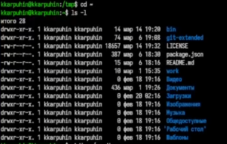
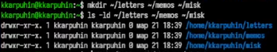
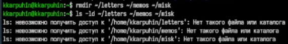
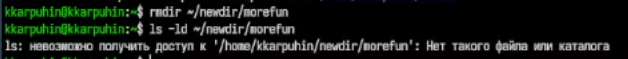
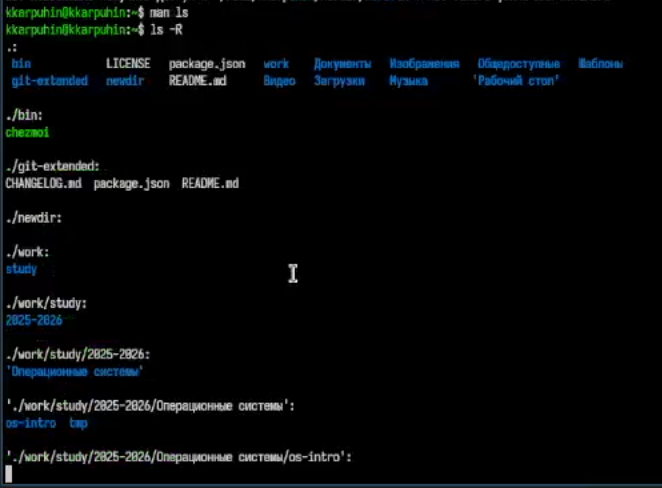
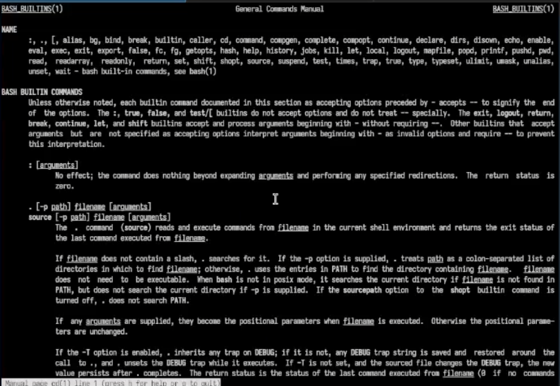
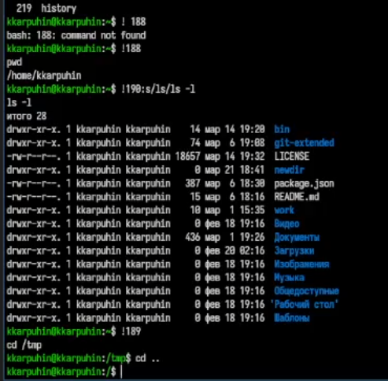

---
## Author
author:
  name: Карпухин Клим
  degrees: 
  orcid: 
  email: 1032255580@rudn.ru
  affiliation:
    - name: Российский университет дружбы народов
      country: Российская Федерация
      postal-code: 117198
      city: Москва
      address: ул. Миклухо-Маклая, д. 6

## Title
title: "Выполнение лабораторной работы №6"
subtitle: "Основы интерфейса взаимодействия пользователя с системой Unix на уровне командной строки."
license: "CC BY"
---

# Цель работы

Приобретение практических навыков взаимодействия пользователя с системой посредством командной строки. Освоение базовых команд работы с файловой системой Linux, а также средств просмотра справки и истории команд. 

# Задание

1. Определить полное имя домашнего каталога.
2. Выполнить переход в каталог `/tmp` и изучить его содержимое с помощью `ls` с различными опциями.
3. Определить наличие каталога `cron` в `/var/spool`.
4. Вернуться в домашний каталог и определить владельцев файлов и подкаталогов.
5. Создать и удалить каталоги с помощью `mkdir`, `rmdir` и `rm`.
6. По справке `man` определить опции `ls` для рекурсивного просмотра и сортировки по времени.
7. Изучить справку по командам `cd`, `pwd`, `mkdir`, `rmdir`, `rm`.
8. Использовать `history` для повторного выполнения и модификации ранее введённых команд. 


# Теоретическое введение

Командная строка в Linux представляет собой способ взаимодействия пользователя с системой через shell-интерпретатор. Команды вводятся текстом и могут содержать аргументы и опции. Для просмотра справочной информации используется команда `man`, для перемещения по файловой системе — `cd`, для вывода текущего каталога — `pwd`, для просмотра содержимого каталогов — `ls`, для создания каталогов — `mkdir`, для удаления пустых каталогов — `rmdir`, для удаления файлов и каталогов — `rm`. Временную историю введённых команд можно просматривать и повторять при помощи `history`. 

Команда `ls` поддерживает опции `-a`, `-l`, `-F`, `-R`, `-t`, которые позволяют показывать скрытые файлы, выводить подробные сведения, отображать тип файла, просматривать подкаталоги рекурсивно и сортировать содержимое по времени изменения. Команда `mkdir` умеет создавать несколько каталогов сразу, а также промежуточные каталоги с опцией `-p`. Команда `rm` удаляет файлы и каталоги, но для удаления каталога требуется опция `-r`, тогда как `rmdir` работает только с пустыми каталогами. 

# Выполнение лабораторной работы

## 1.

Определил полное имя моего домашнего каталога. ([рис. @fig-001]).

{#fig-001 width="70%"}

## 2. 

2.1 Перешёл в каталог/tmp.([рис. @fig-002]).

{#fig-002 width="70%"}  

2.2 Вывел на экран содержимое каталога /tmp. командой `ls`([рис. @fig-003]).

{#fig-003 width="70%"}

Также были использованы различные опции команды `ls` для получения более подробной информации о содержимом каталога `/tmp`:

```
ls -a
ls -l
ls -F
ls -alF
```

Обычная команда `ls` показывает только имена файлов и каталогов. Опция `-a` добавляет скрытые файлы и каталоги, имена которых начинаются с точки. Опция `-l` выводит подробную информацию: права доступа, число ссылок, владельца, группу, размер и дату изменения. Опция `-F` добавляет символ, указывающий тип объекта: `/` для каталога, `*` для исполняемого файла, `@` для символической ссылки. Комбинированный вариант `ls -alF` объединяет все эти возможности.

2.3 Определил,есть ли в каталоге /var/spool подкаталогс именем cron. ([рис. @fig-004]).

{#fig-004 width="70%"}

2.4 Перешёл в мой домашний каталог и вывел на экран его содержимое. ([рис. @fig-005]).

{#fig-005 width="70%"}

Вывод `ls -l` позволил определить владельца файлов и подкаталогов. В соответствующем столбце отображается имя пользователя, которому принадлежат объекты файловой системы.

## 3.

3.1 В домашнем каталоге создал новый каталог с именем newdir. ([рис. @fig-006]).

{#fig-006 width="70%"}

3.2 В каталоге ~/newdir создал новый каталогс именем morefun. ([рис. @fig-007]).

{#fig-007 width="70%"}

3.3 В домашнем каталоге создал одной командойтри новых каталога с именами letters, memos, misk. ([рис. @fig-008]).

{#fig-008 width="70%"}

Затем удалил эти каталоги одной командой. ([рис. @fig-009]).

{#fig-009 width="70%"}

3.4 Попробовал удалить ранее созданный каталог~/newdir командой rm. Каталог не был удалён. ([рис. @fig-010]).

{#fig-010 width="70%"}

3.5  Удалите каталог ~/newdir/morefun из домашнего каталога.Каталог был удалён. ([рис. @fig-011]).

{#fig-011 width="70%"}

## 4.

С помощью команды `man -ls` нашёл опцию для просмотра содержимого не только указанного каталога, но и подкаталогов, входящих в него `ls -R` ([рис. @fig-012]).

{#fig-012 width="70%"}

## 5.

С помощью команды `man -ls` нашёл опции, позволяющие отсортировать по времени последнего изменения выводимый список содержимого каталога с развёрнутым описанием файлов `ls -lt` ([рис. @fig-013]).

{#fig-013 width="70%"}

## 6.

Используйтекомандуmanдляпросмотраописанияследующихкоманд:cd,pwd, mkdir, rmdir, rm. ([рис. @fig-014]).

{#fig-014 width="70%"}

- `cd` — переход в другой каталог. Без аргументов переходит в домашний каталог, `cd ..` поднимает на уровень выше.
- `pwd` - выводит абсолютный путь текущего каталога.
- `mkdir` - создаёт каталоги. Опция `-p` позволяет создавать промежуточные каталоги.
- `rmdir` - удаляет только пустые каталоги.
- `rm` - удаляет файлы. Для удаления каталогов используется `-r`, а для подтверждения удаления  `-i`.


## 7.

Используя информацию, полученную при помощи команды `history`, выполнил модификацию и исполнение нескольких команд из буфера команд. ([рис. @fig-015]).

{#fig-015 width="70%"}

# Контрольные вопросы

# Ответы на контрольные вопросы

## 1. Что такое командная строка?

Командная строка - это текстовый интерфейс для взаимодействия с операционной системой. Через неё я ввожу команды вручную, а система выполняет их и выводит результат в терминал. Такой способ работы позволяет быстро управлять файлами, каталогами и программами.

## 2. При помощи какой команды можно определить абсолютный путь текущего каталога? Приведите пример.

Для определения абсолютного пути текущего каталога я использую команду `pwd`.

Пример:

```
pwd
```

В ответ система может вывести, например:

```
/home/username
```

Это и есть полный путь к текущему каталогу.

## 3. При помощи какой команды и каких опций можно определить только тип файлов и их имена в текущем каталоге? Приведите примеры.

Для этого я использую команду `ls` с опцией `-F`.

Пример:

```
ls -F
```

Эта команда показывает имена файлов и каталогов, а также добавляет символы, указывающие их тип:

- `/` - каталог,
- `*` - исполняемый файл,
- `@` - символическая ссылка.

Если мне нужно вывести только имена файлов без подробностей, я использую:

```
ls
```

## 4. Каким образом отобразить информацию о скрытых файлах? Приведите примеры.

Скрытые файлы в Linux начинаются с точки `.`, поэтому для их отображения я использую опцию `-a` команды `ls`.

Примеры:

```
ls -a
```

или

```
ls -la
```

Первая команда показывает все файлы, включая скрытые. Вторая — то же самое, но в подробном формате.

## 5. При помощи каких команд можно удалить файл и каталог? Можно ли это сделать одной и той же командой? Приведите примеры.

Файл я удаляю командой `rm`.

Пример:

```
rm file.txt
```

Пустой каталог я удаляю командой `rmdir`.

Пример:

```
rmdir mydir
```

Одной и той же командой можно удалить и файл, и каталог, если использовать `rm` для каталога с опцией `-r`.

Пример:

```
rm file.txt
rm -r mydir
```

Но `rm` без `-r` каталог не удалит.

## 6. Каким образом можно вывести информацию о последних выполненных пользователем командах?

Для просмотра истории команд я использую команду `history`.

Пример:

```
history
```

Она выводит список ранее выполненных команд с их номерами, что удобно для повторного запуска и редактирования.

## 7. Как воспользоваться историей команд для их модифицированного выполнения? Приведите примеры.

Я могу воспользоваться номером команды из истории и изменить её перед выполнением.

Пример повторного запуска:

```
!15
```

Это выполнит команду с номером 15 из истории.

Пример изменения команды:

```
!15:s/ls/ls -l/
```

В этом случае команда из истории будет изменена: первое вхождение `ls` заменится на `ls -l`, и команда выполнится уже в новой форме.

## 8. Приведите примеры запуска нескольких команд в одной строке.

Несколько команд в одной строке я могу запускать через `;`, `&&` или `||`.

Примеры:

```
cd /tmp; ls
```

```
mkdir test && cd test
```

```
cd no_such_dir || echo "Каталог не найден"
```

Здесь `;` выполняет команды подряд независимо друг от друга, `&&` запускает вторую команду только если первая успешно завершилась, а `||` — если первая завершилась с ошибкой.

## 9. Дайте определение и приведите примеры символов экранирования.

Символы экранирования —-это специальные символы, которые позволяют использовать в командной строке символы, имеющие особое значение для shell, как обычные символы.

Чаще всего я использую обратный слэш `\`.

Примеры:

```
echo Hello\ world
```

Здесь пробел экранирован, поэтому строка воспринимается как один аргумент.

Ещё пример:

```
echo file\*.txt
```

Если нужно использовать символы буквально, а не как шаблон, их нужно экранировать.

## 10. Охарактеризуйте вывод информации на экран после выполнения команды `ls` с опцией `-l`.

Команда:

```
ls -l
```

выводит подробный список содержимого каталога. В таком выводе я вижу:

- тип и права доступа,
- число ссылок,
- владельца,
- группу,
- размер файла,
- дату и время изменения,
- имя файла или каталога.

Это очень удобно, когда нужно узнать не только названия объектов, но и их свойства.

## 11. Что такое относительный путь к файлу? Приведите примеры использования относительного и абсолютного пути при выполнении какой-либо команды.

Относительный путь — это путь, который задаётся не от корня файловой системы, а относительно текущего каталога.

Пример относительного пути:

```
cd documents
```

Если я нахожусь в домашнем каталоге, то это означает переход в подкаталог `documents`.

Абсолютный путь начинается от корня `/`.

Пример:

```
cd /home/username/documents
```

Оба варианта ведут в один и тот же каталог, но второй не зависит от того, где я нахожусь в данный момент.

## 12. Как получить информацию об интересующей вас команде?

Для этого я использую команду `man`.

Пример:

```
man ls
```

Она открывает справочную страницу команды и позволяет узнать её назначение, синтаксис, опции и примеры использования.

Ещё можно использовать:

```
команда --help
```

например:

```
ls --help
```

Но `man` обычно даёт более полное описание.

## 13. Какая клавиша или комбинация клавиш служит для автоматического дополнения вводимых команд?

Для автоматического дополнения команд я использую клавишу `Tab`.

Если нажать `Tab` после начала ввода команды, имени файла или каталога, терминал может дополнить ввод автоматически. Если вариантов несколько, то повторное нажатие `Tab` показывает доступные варианты.

# Выводы

В ходе выполнения лабораторной работы были освоены основные команды командной строки Unix/Linux. Были изучены переход между каталогами, определение текущего пути, просмотр содержимого каталогов в различных режимах, создание и удаление каталогов, использование справочной системы `man`, а также повторное выполнение и редактирование команд из истории.

Полученные навыки позволяют уверенно работать в терминале, эффективно использовать файловую систему и быстро обращаться к справочной информации по командам.


# Список литературы{.unnumbered}

::: {#refs}
:::