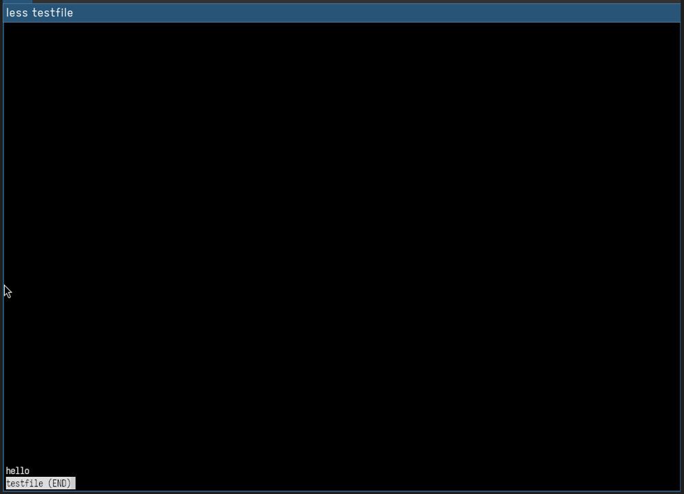
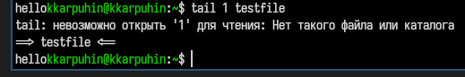
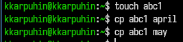
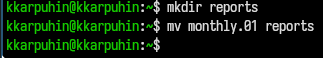
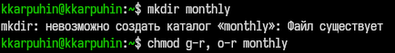
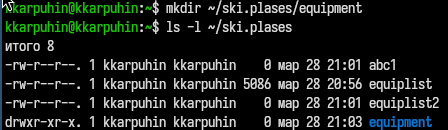
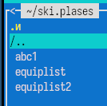

---
## Author
author:
  name: Карпухин Клим
  degrees: ""
  orcid: ""
  email: 1032255580@rudn.ru
  affiliation:
    - name: "Российский университет дружбы народов"
      country: "Российская Федерация"
      postal-code: 117198
      city: "Москва"
      address: "ул. Миклухо-Маклая, д. 6"
## Title
title: "Выполнение лабораторной работы №7"
subtitle: "Анализ файловой системы Linux. Команды для работы с файлами и каталогами."
license: "CC BY"
date: 2026-03-28
date-format: "YYYY-MM-DD"
slide_level: 2

format:
  beamer:
    classoption: "aspectratio=169"
    pdf-engine: xelatex
    number-sections: false
    toc: false
    keep-tex: true

mainfont: "DejaVu Serif"
monofont: "DejaVu Sans Mono"
sansfont: "DejaVu Sans"
---

# Содержание

1. Информация о докладчике
2. Актуальность и цель работы
3. Теоретические основы
4. Ход работы: работа с Midnight Commander
5. Ход работы: команды для работы с файлами
6. Управление правами доступа
7. Системные команды (mount, fsck, mkfs, kill)
8. Контрольные вопросы
9. Выводы

# Информация

## Докладчик

::: {.columns align="center"}
::: {.column width="65%"}

* **Карпухин Клим**
* Российский университет дружбы народов
* Email: [1032255580@rudn.ru](mailto:1032255580@rudn.ru)
* Роль: студент (лабораторная работа по ОС)

:::
::: {.column width="35%"}
{width="90%"}
:::
:::

# Актуальность и цель работы

## Актуальность

- Файловая система Linux имеет строгую иерархическую структуру, знание которой необходимо для эффективной работы.
- Команды для работы с файлами (`cp`, `mv`, `chmod`) являются основой администрирования и повседневной деятельности.
- Midnight Commander (mc) значительно ускоряет работу с файловой системой в терминале.
- Понимание прав доступа критически важно для обеспечения безопасности системы.

## Цель работы

Ознакомление с файловой системой Linux, её структурой, именами и содержанием каталогов. Приобретение практических навыков по применению команд для работы с файлами и каталогами, по управлению процессами, по проверке использования диска и обслуживанию файловой системы.

# Теоретические основы

## Основные команды

| Команда | Назначение |
|---------|------------|
| `touch` | Создание пустого файла / обновление метки времени |
| `cat` / `less` / `head` / `tail` | Просмотр содержимого файлов |
| `cp` | Копирование файлов и каталогов |
| `mv` | Перемещение / переименование объектов |
| `chmod` | Изменение прав доступа |
| `mount` / `df` | Монтирование и анализ использования диска |
| `fsck` / `mkfs` | Проверка и создание файловых систем |
| `kill` | Отправка сигналов процессам |

# Ход работы: Midnight Commander

## Запуск и интерфейс mc

* Запустил Midnight Commander командой `mc` в терминале.
* Изучил структуру: две панели, строка меню, командная строка внизу.

{width="60%"}

## Навигация и функциональные клавиши

* Навигация: клавиши-стрелки, `Enter` для входа, `Ctrl+PageUp` для выхода.
* Функциональные клавиши:
  - `F1` — справка
  - `F3` — просмотр файла
  - `F4` — редактирование
  - `F5` — копирование
  - `F6` — перемещение/переименование
  - `F7` — создание каталога
  - `F8` — удаление
  - `F9` — главное меню
  - `F10` — выход

{width="60%"}

## Работа с панелями

* Переключение между панелями: `Tab`
* Установил в левой панели `/tmp`, в правой — домашний каталог.
* Изменение формата отображения: `Левая панель` → `Формат списка` (стандартный, длинный, с правами доступа).

{width="60%"}

## Меню «Команда» и поиск

* Открыл меню `Команда`: `Дерево каталогов`, `Поиск файла`, `Каталоги быстрого перехода`.
* Нашёл файлы, содержащие слово `bash`, в каталоге `/etc`.

{width="60%"}

# Ход работы: просмотр и редактирование

## Просмотр и редактирование файлов

* **Просмотр** (`F3`): открыл текстовый файл для просмотра.

{width="60%"}

* **Редактирование** (`F4`): открыл файл в редакторе mcedit, внёс изменения, сохранил (`F2`).

{width="60%"}

## Создание и копирование файлов

* Создал новый файл `test.txt` через редактор (`F4` при несуществующем имени).
* Скопировал файл в `/tmp` с помощью `F5`.
* Переименовал копию в `/tmp` с помощью `F6`.

{width="60%"}

## Операции с каталогами

* Создал каталог `lab7dir` (`F7`).
* Скопировал `test.txt` в созданный каталог.
* Выделение файлов: `Insert` для выборочного выделения, `+` для выделения по маске (`*.txt`).
* Удаление выделенных файлов (`F8`).

## Дерево каталогов и поиск

* Включил отображение дерева каталогов: `Панели` → `Дерево каталогов`.

{width="60%"}

* Использовал встроенный поиск файлов по содержимому (`Команда` → `Поиск файла` или `Alt+?`).

## Встроенный редактор mcedit

* Открыл `~/.bashrc` (`F4`) и изучил возможности редактора:
  - поиск по тексту (`F7`);
  - замена (`F4` в режиме поиска);
  - переход к строке (`Alt+L`);
  - включение подсветки синтаксиса.

* Создал файл `note.txt`, поработал с буфером обмена (`F5` — копировать, `F6` — переместить).

{width="60%"}

## Меню пользователя и настройки mc

* `F2` — меню пользователя для определения собственных команд.
* `F9` — главное меню: `Левая`, `Файл`, `Команда`, `Настройки`, `Правая`.
* В разделе `Настройки` → `Внешний вид` изменил цветовую схему.

{width="60%"}

# Ход работы: задание 2 (псевдонимы)

## Добавление псевдонимов в .bashrc

Добавил в файл `~/.bashrc` следующие псевдонимы:

```bash
alias up='cd ..'
alias ll='ls -la'
alias h='history'
alias cls='clear'
alias grep='grep --color=auto'
```

{width="60%"}

## Проверка работы псевдонимов

После выполнения `source ~/.bashrc`:

* `up` — переход на уровень выше.
* `ll` — подробный список файлов.
* `h` — история команд.
* `cls` — очистка экрана.
* `grep` — цветная подсветка вхождений.

{width="60%"}

# Ход работы: задание 3 и 4

## Задание 3: команды в командной строке mc

* В командной строке mc выполнил:
  - `cat /etc/shells` — список доступных оболочек.
  - `echo $SHELL` — текущая оболочка.

{width="60%"}

## Задание 4: упражнения с файлами

**4.1** Просмотр `/etc/password` через `F3`.
**4.2** Копирование `~/feathers` → `~/file.old`:
```bash
cp ~/feathers ~/file.old
```
**4.3** Перемещение `~/file.old` → `~/play`:
```bash
mv ~/file.old ~/play
```
**4.4** Копирование каталога `~/play` → `~/fun`:
```bash
cp -r ~/play ~/fun
```
**4.5** Перемещение и переименование `~/fun` → `~/play/games`:
```bash
mv ~/fun ~/play/games
```

# Управление правами доступа

## Изменение прав доступа

**4.6** Лишение владельца права на чтение файла `~/feathers`:
```bash
chmod u-r ~/feathers
```
**4.7** Попытка просмотра (`cat`) → ошибка `Permission denied`.
**4.8** Попытка копирования (`cp`) → ошибка `Permission denied`.

{width="60%"}

**4.9** Возврат права на чтение:
```bash
chmod u+r ~/feathers
```

## Права на выполнение для каталога

**4.10** Лишение владельца права на выполнение каталога `~/play`:
```bash
chmod u-x ~/play
```
**4.11** Попытка перехода (`cd ~/play`) → ошибка `Permission denied`.
**4.12** Возврат права на выполнение:
```bash
chmod u+x ~/play
```

# Системные команды

## mount, fsck, mkfs, kill

| Команда | Назначение | Пример |
|---------|------------|--------|
| `mount` | Монтирование файловых систем | `mount /dev/sdb1 /mnt` |
| `fsck` | Проверка и восстановление ФС | `fsck /dev/sda1` |
| `mkfs` | Создание файловой системы | `mkfs.ext4 /dev/sdb1` |
| `kill` | Отправка сигналов процессам | `kill -9 1234` |

* `man mount` — справка по монтированию.
* `man fsck` — параметры проверки ФС.
* `man mkfs` — создание ФС разных типов.
* `man kill` — список сигналов (`-l`).

# Контрольные вопросы (1-7)

1. **Командная строка** — текстовый интерфейс взаимодействия с ОС.
2. **Абсолютный путь** текущего каталога: `pwd`.
3. **Тип файлов и их имена**: `ls -F`.
4. **Скрытые файлы**: `ls -a` или `ls -la`.
5. **Удаление файла**: `rm`, **пустого каталога**: `rmdir`. Можно одной командой: `rm -r`.
6. **История команд**: `history`.
7. **Модифицированное выполнение**: `!15` или `^old^new`.

# Контрольные вопросы (8-13)

8. **Несколько команд в одной строке**: `;`, `&&`, `||`. Пример: `cd /tmp; ls`.
9. **Экранирование**: `\`. Пример: `echo Hello\ world`.
10. **`ls -l`**: права, ссылки, владелец, группа, размер, дата, имя.
11. **Относительный путь**: `documents`, **абсолютный**: `/home/user/documents`.
12. **Справка**: `man <команда>` или `<команда> --help`.
13. **Автодополнение**: `Tab`.

# Выводы

## Результаты работы

* Освоил работу с Midnight Commander (mc): навигация, функциональные клавиши, панели, поиск, редактирование.
* Приобрел практические навыки работы с командами `cp`, `mv`, `chmod`.
* Изучил механизм изменения прав доступа к файлам и каталогам.
* Познакомился с системными командами `mount`, `fsck`, `mkfs`, `kill`.
* Научился создавать псевдонимы в `.bashrc` для ускорения работы.

## Ключевые навыки

* Уверенная навигация по файловой системе Linux.
* Копирование, перемещение, переименование файлов и каталогов.
* Управление правами доступа.
* Использование справочной системы `man`.
* Работа с историей команд.

# Список литературы

::: {#refs}
:::