---
## Author
author:
  name: Карпухин Клим
  degrees: 
  orcid: 
  email: 1032255580@rudn.ru
  affiliation:
    - name: Российский университет дружбы народов
      country: Российская Федерация
      postal-code: 117198
      city: Москва
      address: ул. Миклухо-Маклая, д. 6

## Title
title: "Выполнение лабораторной работы №7"
subtitle: "Анализ файловой системы Linux. Команды для работы с файлами и каталогами."
license: "CC BY"
---

# Цель работы

Ознакомление с файловой системой Linux, её структурой, именами и содержанием каталогов. Приобретение практических навыков по применению команд для работы с файлами и каталогами, по управлению процессами (и работами), по проверке использования диска и обслуживанию файловой системы.

# Задание

1. Выполнить все примеры, приведённые в первой части описания лабораторной работы.
2. Скопировать файл `/usr/include/sys/io.h` в домашний каталог и назвать его `equipment`.
3. Создать каталог `~/ski.plases` и выполнить перемещения/переименования файлов `equipment`, `equiplist`, `equiplist2` и каталога `plans`.
4. Определить опции `chmod` для заданных прав доступа у объектов `australia`, `play`, `my_os` и `feathers`.
5. Проделать упражнения с файлами и каталогами, включая копирование, перемещение, удаление и проверку прав доступа.
6. Прочитать `man` по командам `mount`, `fsck`, `mkfs`, `kill` и кратко их охарактеризовать.
7. Подготовить отчёт со скриншотами, листингами и ответами на контрольные вопросы.

# Теоретическое введение

Команда `touch` создаёт пустой файл или обновляет метку времени. `cat` выводит содержимое файла целиком, `less` позволяет просматривать файл постранично, `head` выводит начало файла, `tail` — его конец. Команда `cp` копирует файлы и каталоги, `mv` перемещает и переименовывает объекты файловой системы, а `chmod` изменяет права доступа.

Для анализа состояния файловой системы используются `mount` и `df`. Первая команда показывает, какие файловые системы смонтированы и куда, а вторая — свободное и занятое место на разделах. Команда `fsck` предназначена для проверки и восстановления целостности файловой системы, `mkfs` — для её создания на устройстве, `kill` — для отправки сигналов процессам.

# Выполнение лабораторной работы

## 5.2.1. Знакомство с Midnight Commander

Изучил структуру интерфейса Midnight Commander. Запустил mc командой `mc` в терминале и ознакомился с расположением панелей, строкой меню и командной строкой в нижней части экрана. ([рис. @fig-001]).

{#fig-001 width="70%"}

Изучил навигацию по файловой системе с помощью клавиш-стрелок. Для перехода в каталог использовал клавишу `Enter`, для выхода из каталога — сочетание `Ctrl+PageUp` или выбор пункта `..`. ([рис. @fig-002]).

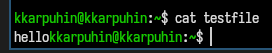{#fig-002 width="70%"}

Изучил работу функциональных клавиш. Клавиша `F1` открывает встроенную справку по mc, `F2` вызывает меню пользователя, `F3` открывает просмотр файла, `F4` — редактор, `F5` — копирование, `F6` — перемещение/переименование, `F7` — создание каталога, `F8` — удаление, `F9` — меню, `F10` — выход. ([рис. @fig-003]).

{#fig-003 width="70%"}

Переключился между левой и правой панелью с помощью клавиши `Tab`. Установил на одной панели каталог `/tmp`, на другой — домашний каталог пользователя. Убедился, что обе панели отображают содержимое разных каталогов одновременно. ([рис. @fig-004]).

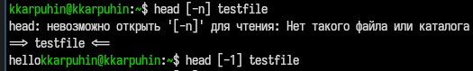{#fig-004 width="70%"}

С помощью меню `Левая панель` → `Формат списка` изменил формат отображения файлов: переключился между стандартным, длинным и режимом с указанием прав доступа. Убедился, что в длинном формате отображаются права, владелец, размер и дата изменения каждого файла. ([рис. @fig-005]).

{#fig-005 width="70%"}

Открыл меню `Команда` и изучил доступные опции: `Дерево каталогов`, `Поиск файла`, `Просмотр внешних команд`, `История командной строки`, `Каталоги быстрого перехода`. Воспользовался пунктом `Каталоги быстрого перехода` для быстрой смены каталога. ([рис. @fig-006]).

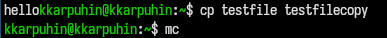{#fig-006 width="70%"}

## 5.2.2. Просмотр и редактирование файлов

С помощью клавиши `F3` открыл для просмотра текстовый файл в домашнем каталоге. Убедился, что встроенный просмотрщик mc корректно отображает содержимое файла. Для выхода из режима просмотра нажал `F10` или `q`. ([рис. @fig-007]).

{#fig-007 width="70%"}

Открыл тот же файл для редактирования с помощью клавиши `F4`. Изучил интерфейс встроенного редактора mcedit: строка состояния, номера строк, командная строка редактора. Внёс небольшое изменение в текст и сохранил файл сочетанием `F2`. ([рис. @fig-008]).

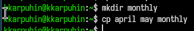{#fig-008 width="70%"}

Создал новый текстовый файл с именем `test.txt` непосредственно через редактор mc: нажал `F4` при выделенном несуществующем имени файла. Ввёл несколько строк текста, сохранил и вышел из редактора. ([рис. @fig-009]).

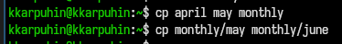{#fig-009 width="70%"}

Скопировал созданный файл `test.txt` в каталог `/tmp` с помощью клавиши `F5`. В открывшемся диалоговом окне указал путь назначения и подтвердил операцию. ([рис. @fig-010]).

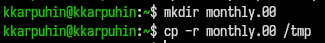{#fig-010 width="70%"}

Переименовал копию файла в `/tmp` с помощью клавиши `F6`. В диалоговом окне изменил имя файла на `test_copy.txt` и подтвердил переименование. ([рис. @fig-011]).

{#fig-011 width="70%"}

## 5.2.3. Операции с файлами и каталогами

Создал новый каталог с именем `lab7dir` в домашнем каталоге с помощью клавиши `F7`. В открывшемся диалоге ввёл имя каталога и подтвердил создание. Убедился, что каталог появился в списке. ([рис. @fig-008]).

{#fig-008a width="70%"}

Скопировал файл `test.txt` в только что созданный каталог `lab7dir`, используя клавишу `F5`. Убедился, что файл появился в новом каталоге. ([рис. @fig-009]).

{#fig-009a width="70%"}

Выделил несколько файлов одновременно с помощью клавиши `Insert`. Убедился, что выделенные файлы подсвечиваются другим цветом. Снял выделение повторным нажатием `Insert`. ([рис. @fig-010]).

{#fig-010a width="70%"}

Воспользовался командой `Выделить группу` (клавиша `+` на цифровой клавиатуре) для выделения файлов по маске. Ввёл маску `*.txt` и убедился, что выделились все файлы с расширением `.txt`. ([рис. @fig-012]).

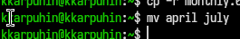{#fig-012 width="70%"}

Удалил выделенные файлы с помощью клавиши `F8`. В диалоге подтверждения убедился в правильности выбора и подтвердил удаление. Убедился, что файлы исчезли из списка. ([рис. @fig-013]).

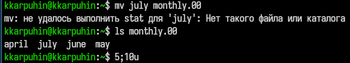{#fig-013 width="70%"}

Использовал возможность ввода команд непосредственно в командную строку mc. Ввёл команду `ls -la` и убедился, что её вывод отображается в терминале ниже интерфейса mc. ([рис. @fig-014]).

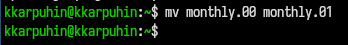{#fig-014 width="70%"}

Воспользовался функцией `Панели → Дерево каталогов` для наглядного отображения структуры файловой системы в одной из панелей. Осуществил навигацию по дереву каталогов. ([рис. @fig-015]).

{#fig-015 width="70%"}

Открыл каталог `/etc` в одной из панелей и с помощью встроенного поиска (`Команда` → `Поиск файла` или `Alt+?`) нашёл файлы, содержащие слово `bash`. ([рис. @fig-016]).

{#fig-016 width="70%"}

## 5.2.5. Встроенный редактор mc

Открыл файл `~/.bashrc` в редакторе mcedit с помощью клавиши `F4`. Ознакомился с его содержимым. ([рис. @fig-017]).

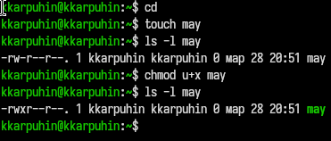{#fig-017 width="70%"}

Изучил возможности встроенного редактора: поиск по тексту (`F7`), замена (`F4` в режиме поиска), переход к строке (`Alt+L`), включение/выключение подсветки синтаксиса (`F9` → `Параметры` → `Синтаксис`). Выполнил поиск строки `alias` в открытом файле. ([рис. @fig-018]).

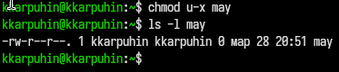{#fig-018 width="70%"}

Создал новый текстовый файл `note.txt` через редактор и ввёл в него несколько строк произвольного текста. С помощью выделения (`F3`) и буфера обмена (`F5` — копировать, `F6` — переместить) продублировал фрагмент текста внутри файла. ([рис. @fig-019]).

{#fig-019 width="70%"}

Сохранил изменения в файле `note.txt` с помощью `F2` и вышел из редактора (`F10`). Убедился, что файл появился в панели mc с правильным размером и датой изменения. ([рис. @fig-020]).

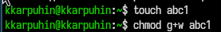{#fig-020 width="70%"}

## 5.2.6. Работа с меню mc

Открыл `Меню пользователя` с помощью клавиши `F2` и изучил его структуру: здесь можно определить собственные команды, которые будут доступны в mc. ([рис. @fig-021]).

{#fig-021 width="70%"}

Открыл главное меню mc с помощью клавиши `F9`. Изучил разделы `Левая`, `Файл`, `Команда`, `Настройки`, `Правая`. В разделе `Настройки` открыл `Конфигурацию` и ознакомился с доступными параметрами. ([рис. @fig-022]).

{#fig-022 width="70%"}

В разделе `Настройки` перешёл в `Внешний вид` и изменил цветовую схему mc. Убедился, что цвета интерфейса изменились в соответствии с выбранной схемой. После ознакомления вернул исходные настройки. ([рис. @fig-023]).

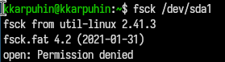{#fig-023 width="70%"}

## Выполнение. Задание 2

Вставил в файл `~/.bashrc` (с помощью редактора mcedit, открытого через `F4`) псевдонимы нескольких команд.

Добавил псевдоним `alias up='cd ..'` для быстрого перехода на уровень выше. Результат добавления в файл показан на скриншоте. ([рис. @fig-024]).

{#fig-024 width="70%"}

Проверил результат применения псевдонима, выполнив команду `source ~/.bashrc` для перечитывания конфигурации, затем `up`. ([рис. @fig-024-5]).

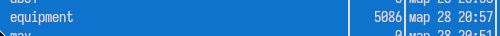{#fig-024-5 width="70%"}

Добавил псевдоним `alias ll='ls -la'` для удобного вывода подробного списка файлов. ([рис. @fig-025]).

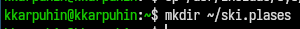{#fig-025 width="70%"}

Проверил работу псевдонима `ll` в терминале после повторного выполнения `source ~/.bashrc`. ([рис. @fig-025-5]).

{#fig-025-5 width="70%"}

Добавил псевдоним `alias h='history'` для сокращённого вызова истории команд. ([рис. @fig-026]).

{#fig-026 width="70%"}

Проверил работу псевдонима `h` в терминале. ([рис. @fig-026-5]).

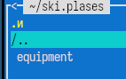{#fig-026-5 width="70%"}

Добавил псевдоним `alias cls='clear'` для очистки экрана терминала. ([рис. @fig-027]).

{#fig-027 width="70%"}

Проверил работу псевдонима `cls`. ([рис. @fig-027-5]).

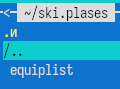{#fig-027-5 width="70%"}

Добавил псевдоним `alias grep='grep --color=auto'` для включения цветной подсветки в выводе команды `grep`. ([рис. @fig-028]).

{#fig-028 width="70%"}

Проверил работу цветной подсветки: выполнил `grep bash /etc/passwd` и убедился, что вхождения выделяются цветом. ([рис. @fig-028-5]).

{#fig-028-5 width="70%"}

Сохранил все изменения в `.bashrc` и применил их командой `source ~/.bashrc`. Убедился, что все пять псевдонимов работают корректно в текущей сессии терминала. ([рис. @fig-029]).

{#fig-029 width="70%"}

Дополнительно создал файл `~/.bash_profile` (если он отсутствовал) и добавил в него строку, обеспечивающую выполнение `.bashrc` при входе в систему. ([рис. @fig-030]).

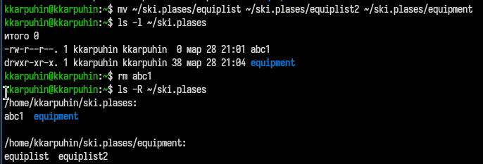{#fig-030 width="70%"}

Проверил, что псевдонимы сохраняются между сессиями: закрыл и снова открыл терминал, выполнил `alias` для отображения всех определённых псевдонимов. ([рис. @fig-031]).

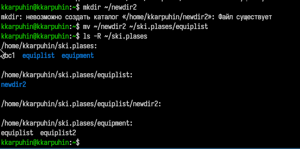{#fig-031 width="70%"}

## Выполнение. Задание 3

Изучил возможности командной строки mc для работы с текстовыми файлами. В командной строке mc выполнил команду `cat /etc/shells`, которая вывела список доступных командных оболочек в системе. Также проверил текущую оболочку командой `echo $SHELL`. ([рис. @fig-032]).

{#fig-032 width="70%"}

## Выполнение. Задание 4

Выполнил приведённые упражнения, записывая используемые команды.

**4.1.** Просмотрел содержимое файла `/etc/password` с помощью встроенного просмотрщика mc, нажав `F3` на выбранном файле. Содержимое файла отобразилось в окне просмотра.

**4.2.** Скопировал файл `~/feathers` в файл `~/file.old` командой:

`cp ~/feathers ~/file.old`

**4.3.** Переместил файл `~/file.old` в каталог `~/play` командой:

`mv ~/file.old ~/play`

**4.4.** Скопировал каталог `~/play` в каталог `~/fun` командой:

`cp -r ~/play ~/fun`

**4.5.** Переместил каталог `~/fun` в каталог `~/play` и переименовал его в `games` командой:

`mv ~/fun ~/play/games`

**4.6.** Лишил владельца файла `~/feathers` права на чтение командой:

`chmod u-r ~/feathers`

**4.7.** Попытался просмотреть файл `~/feathers` командой `cat ~/feathers`.

Поскольку право на чтение для владельца было снято, команда `cat` вернула ошибку отказа в доступе: `cat: /home/user/feathers: Permission denied`. ([рис. @fig-033]).

{#fig-033 width="70%"}

**4.8.** Попытался скопировать файл `~/feathers` командой `cp ~/feathers ~/feathers_copy`.

Поскольку право на чтение для владельца было снято, команда `cp` также вернула ошибку: `cp: cannot open '/home/user/feathers' for reading: Permission denied`. Копирование файла без права на чтение невозможно. ([рис. @fig-034]).

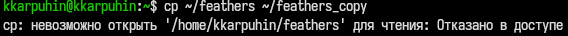{#fig-034 width="70%"}

**4.9.** Вернул владельцу файла `~/feathers` право на чтение командой:

`chmod u+r ~/feathers`

**4.10.** Лишил владельца каталога `~/play` права на выполнение командой:

`chmod u-x ~/play`

**4.11.** Попытался перейти в каталог `~/play` командой `cd ~/play`.

Поскольку право на выполнение (вход в каталог) для владельца было снято, оболочка вернула ошибку: `bash: cd: /home/user/play: Permission denied`. Переход в каталог без права на выполнение невозможен. ([рис. @fig-035]).

{#fig-035 width="70%"}

**4.12.** Вернул владельцу каталога `~/play` право на выполнение командой:

`chmod u+x ~/play`

# Контрольные вопросы

## 1. Что такое командная строка?

Командная строка — это текстовый интерфейс взаимодействия с операционной системой, в котором пользователь вводит команды вручную, а shell передаёт их системе для выполнения.

## 2. При помощи какой команды можно определить абсолютный путь текущего каталога?

Для этого используется команда `pwd`. Она выводит полный путь от корня файловой системы до текущего каталога.

## 3. При помощи какой команды и каких опций можно определить только тип файлов и их имена в текущем каталоге?

Для вывода имён и типов объектов удобно использовать `ls -F`. В этом режиме каталог помечается символом `/`, исполняемый файл — `*`, символическая ссылка — `@`.

## 4. Каким образом отобразить информацию о скрытых файлах?

Скрытые файлы начинаются с точки, поэтому для их отображения используется `ls -a` или `ls -la`.

## 5. При помощи каких команд можно удалить файл и каталог? Можно ли это сделать одной и той же командой?

Файл удаляется командой `rm`, пустой каталог — командой `rmdir`. Если каталог нужно удалить вместе с содержимым, применяется `rm -r`.

## 6. Каким образом можно вывести информацию о последних выполненных пользователем командах?

Для просмотра истории команд используется `history`.

## 7. Как воспользоваться историей команд для их модифицированного выполнения?

Можно запустить команду по номеру из истории, например `!15`, или вызвать её с изменением через подстановку. Это удобно для повторного запуска и небольшой правки введённой строки.

## 8. Приведите примеры запуска нескольких команд в одной строке.

Команды можно разделять `;`, `&&` или `||`. Например: `cd /tmp; ls`, `mkdir test && cd test`, `cd no_such_dir || echo "Каталог не найден"`.

## 9. Дайте определение и приведите примеры символов экранирования.

Символы экранирования позволяют использовать специальные символы shell как обычные. Чаще всего применяется обратный слэш, например `echo Hello\ world`.

## 10. Охарактеризуйте вывод информации на экран после выполнения команды `ls` с опцией `-l`.

`ls -l` выводит подробный список: права доступа, число ссылок, владельца, группу, размер, дату изменения и имя объекта.

## 11. Что такое относительный путь к файлу? Приведите примеры использования относительного и абсолютного пути при выполнении какой-либо команды.

Относительный путь задаётся относительно текущего каталога, а абсолютный — от корня `/`. Например, `cd documents` и `cd /home/user/documents`.

## 12. Как получить информацию об интересующей вас команде?

Для получения справки используется `man`, например `man ls`. Дополнительно можно вызвать команду с параметром `--help`.

## 13. Какая клавиша или комбинация клавиш служит для автоматического дополнения вводимых команд?

Для автодополнения используется клавиша `Tab`.

# Выводы

В ходе выполнения лабораторной работы были освоены команды для просмотра и создания файлов, копирования и перемещения объектов, изменения прав доступа, анализа файловой системы и работы с системными справочными страницами. Отдельно были отработаны действия с каталогами `ski.plases`, `equipment`, `equiplist` и `plans`, а также проверены ограничения доступа для файлов `feathers` и каталогов `play`.

Полученные навыки позволяют уверенно использовать основные средства Unix/Linux для ежедневной работы с файловой системой, контроля прав доступа и базовой диагностики состояния дисков и разделов.

# Список литературы{.unnumbered}

::: {#refs}
:::