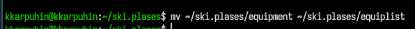
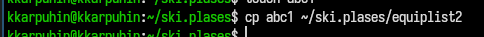
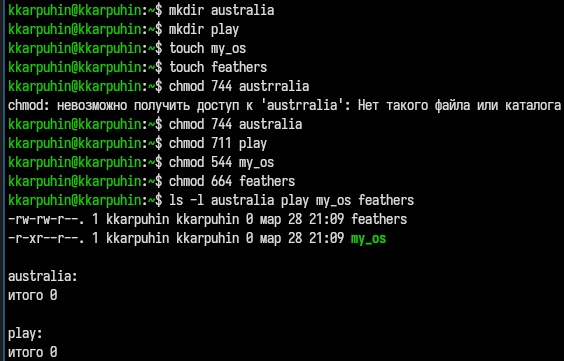
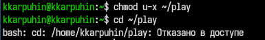
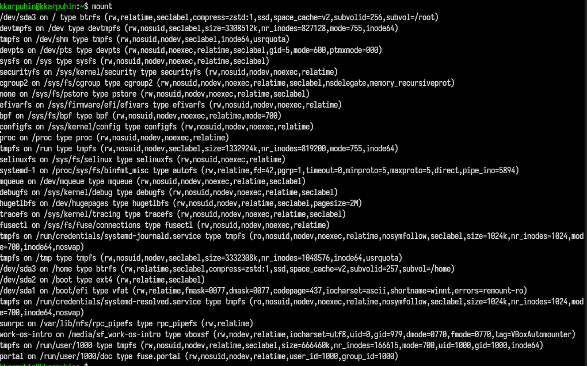
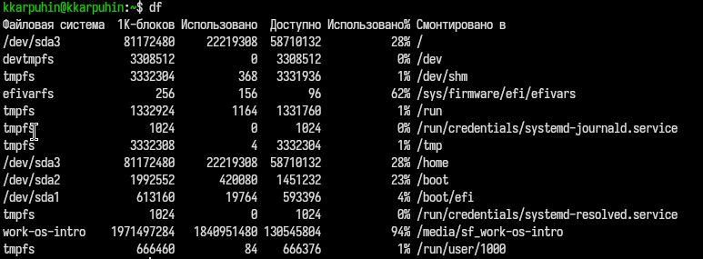

---
## Author
author:
  name: Карпухин Клим
  degrees: ""
  orcid: ""
  email: 1032255580@rudn.ru
  affiliation:
    - name: "Российский университет дружбы народов"
      country: "Российская Федерация"
      postal-code: 117198
      city: "Москва"
      address: "ул. Миклухо-Маклая, д. 6"

## Title
title: "Выполнение лабораторной работы №8"
subtitle: "Анализ файловой системы Linux. Команды для работы с файлами и каталогами."
license: "CC BY"
date: 2026-03-28
date-format: "YYYY-MM-DD"
slide_level: 2

format:
  beamer:
    classoption: "aspectratio=169"
    pdf-engine: xelatex
    number-sections: false
    toc: false
    keep-tex: true

mainfont: "DejaVu Serif"
monofont: "DejaVu Sans Mono"
sansfont: "DejaVu Sans"
---

# Информация о докладчике

## Докладчик

::: {.columns align="center"}
::: {.column width="65%"}

* **Карпухин Клим**
* Российский университет дружбы народов
* Email: [1032255580@rudn.ru](mailto:1032255580@rudn.ru)
* Роль: студент (лабораторная работа по ОС/виртуализации)

:::
:::

# Вводная часть

## Актуальность

- Файловая система Linux — основа любой Unix-подобной системы.
- Умение управлять файлами и каталогами через командную строку необходимо для администрирования, разработки и повседневной работы.
- Знание команд `cp`, `mv`, `chmod`, `mount`, `df`, `fsck` позволяет эффективно работать с дисками, правами доступа и структурой каталогов.
- Лабораторная работа даёт практические навыки, которые пригодятся в дальнейшем изучении операционных систем.

## Объект и предмет исследования

* **Объект:** файловая система Linux и способы управления ею.
* **Предмет:** команды для копирования, перемещения, изменения прав доступа, а также утилиты для анализа и обслуживания файловой системы.

# Научная новизна и практическая значимость

## Научная новизна

* Изучение поведения стандартных команд Unix/Linux в реальной среде Fedora Sway.
* Демонстрация влияния прав доступа на возможность чтения, записи и выполнения файлов и каталогов.
* Практическое знакомство с утилитами `mount`, `df`, `fsck`, `mkfs` через справочную систему `man`.

## Практическая значимость работы

* Полученные навыки позволяют уверенно копировать, перемещать и переименовывать файлы и каталоги.
* Освоение `chmod` даёт возможность гибко управлять доступом к объектам.
* Умение анализировать состояние файловой системы (`mount`, `df`) полезно для диагностики и оптимизации работы системы.
* Понимание утилит `fsck`, `mkfs`, `kill` расширяет кругозор в системном администрировании.

# Цель, гипотеза и задачи

## Цель

Ознакомиться с файловой системой Linux, её структурой, именами и содержанием каталогов, а также приобрести практические навыки применения команд для работы с файлами и каталогами, управления процессами и обслуживания файловой системы.

## Гипотеза

Если освоить команды `cp`, `mv`, `chmod`, `mount`, `df`, `fsck`, `mkfs`, `kill` и научиться работать со справочной системой `man`, то можно эффективно управлять файловой системой Linux и диагностировать её состояние.

## Задачи

1. Выполнить примеры команд для работы с файлами и каталогами.
2. Скопировать, переместить, переименовать файлы и каталоги согласно заданию.
3. Изменить права доступа для файлов `australia`, `play`, `my_os`, `feathers` с помощью `chmod`.
4. Проделать упражнения с файлами и каталогами, проверив влияние прав доступа.
5. Изучить справочные страницы команд `mount`, `fsck`, `mkfs`, `kill`.
6. Подготовить отчёт с листингами и скриншотами.

# Материалы и методы

## Материалы и методы

* **Операционная система:** Fedora Linux.
* **Окружение рабочего стола:** Sway.
* **Инструменты:**
  * команды `touch`, `cat`, `less`, `head`, `tail`;
  * команды `cp`, `mv`, `chmod`;
  * утилиты `mount`, `df`, `fsck`, `mkfs`, `kill`;
  * справочная система `man`.
* **Методика:** последовательное выполнение команд в терминале с фиксацией результата на скриншотах и анализом вывода.

# Выполнение работы

## Копирование файла `/usr/include/sys/io.h`

Скопировал файл `/usr/include/sys/io.h` в домашний каталог под именем `equipment`.

{width="70%"}

## Создание каталога `~/ski.plases`

Создал каталог `~/ski.plases`.

{width="70%"}

## Перемещение и переименование файла `equipment`

Переместил `equipment` в `~/ski.plases` и переименовал в `equiplist`.

{width="70%"}

{width="70%"}

## Создание и копирование файла `equiplist2`

Создал файл `abc1` и скопировал его в `~/ski.plases` как `equiplist2`.

{width="70%"}

## Создание каталога `equipment` и перемещение файлов

Создал каталог `equipment` внутри `~/ski.plases` и переместил в него файлы `equiplist` и `equiplist2`.

{width="70%"}

{width="70%"}

## Создание, перемещение и переименование каталога `plans`

Создал каталог `~/newdir`, переместил его в `~/ski.plases` и переименовал в `plans`.

{width="70%"}

## Изменение прав доступа для файлов

Выполнил команды `chmod` для файлов:
- `chmod 754 australia`
- `chmod 711 play`
- `chmod 544 my_os`
- `chmod 664 feathers`

Результат проверил командой `ls -l`.

{width="70%"}

## Упражнение: лишение права на чтение файла `feathers`

Лишил владельца права на чтение файла `~/feathers` (`chmod u-r ~/feathers`).

## Попытка просмотра файла `feathers`

При попытке просмотреть `~/feathers` командой `cat` возникла ошибка доступа.

{width="70%"}

## Попытка копирования файла `feathers`

При попытке скопировать `~/feathers` возникла ошибка доступа.

{width="70%"}

## Возврат права на чтение

Вернул владельцу право на чтение (`chmod u+r ~/feathers`).

## Упражнение: лишение права на выполнение каталога `play`

Лишил владельца права на выполнение каталога `~/play` (`chmod u-x ~/play`).

## Попытка перехода в каталог `play`

При попытке перейти в `~/play` командой `cd ~/play` возникла ошибка доступа.

{width="70%"}

## Возврат права на выполнение

Вернул владельцу право на выполнение каталога `~/play` (`chmod u+x ~/play`).

## Анализ файловой системы: команда `mount`

Просмотрел смонтированные файловые системы с помощью `mount`.

{width="70%"}

## Анализ файловой системы: файл `/etc/fstab`

Просмотрел содержимое файла `/etc/fstab`.

{width="70%"}

## Анализ файловой системы: команда `df`

Определил объём свободного пространства командой `df`.

{width="70%"}

## Изучение справочных страниц

Прочитал `man` по командам:
- `mount` — монтирование файловых систем.
- `fsck` — проверка и восстановление целостности файловой системы.
- `mkfs` — создание файловой системы на устройстве.
- `kill` — отправка сигналов процессам.

# Результаты и анализ

## Анализ достигнутых результатов

- Скопирован и переименован файл `equipment` → `equiplist`, создан каталог `ski.plases`, выполнены перемещения согласно заданию.
- Настроены права доступа `754`, `711`, `544`, `664` для заданных файлов.
- Продемонстрировано влияние прав доступа на возможность чтения и выполнения: при отсутствии права на чтение файл нельзя просмотреть или скопировать, а без права на выполнение нельзя войти в каталог.
- Изучены смонтированные файловые системы, содержимое `/etc/fstab` и свободное место на дисках.
- Получены краткие характеристики команд `mount`, `fsck`, `mkfs`, `kill` из справочной системы.

## Практическая значимость результатов

- Сформированы навыки копирования, перемещения, переименования файлов и каталогов в Linux.
- Освоено управление правами доступа с помощью `chmod`.
- Приобретены умения анализировать состояние файловой системы (смонтированные разделы, свободное пространство).
- Расширены знания о системных утилитах для работы с дисками и процессами.

# Выводы

## Общее заключение

В ходе лабораторной работы:
- Освоены команды для работы с файлами и каталогами (`cp`, `mv`, `chmod`).
- Выполнены практические задания по копированию, перемещению и переименованию объектов.
- Изучены права доступа и их влияние на операции с файлами и каталогами.
- Получены навыки анализа файловой системы с помощью `mount` и `df`.
- Изучены справочные страницы утилит `mount`, `fsck`, `mkfs`, `kill`.

## Выводы

1. Команды `cp`, `mv`, `chmod` позволяют гибко управлять объектами файловой системы.
2. Права доступа играют ключевую роль в безопасности и работоспособности системы.
3. Утилиты `mount` и `df` дают полную картину о смонтированных разделах и использовании дискового пространства.
4. Справочная система `man` является незаменимым инструментом для изучения новых команд.
5. Полученные навыки являются базовыми для дальнейшего освоения администрирования Linux.