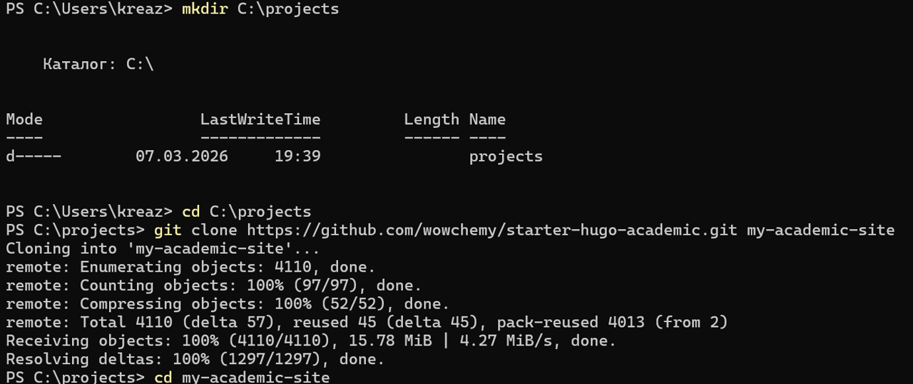
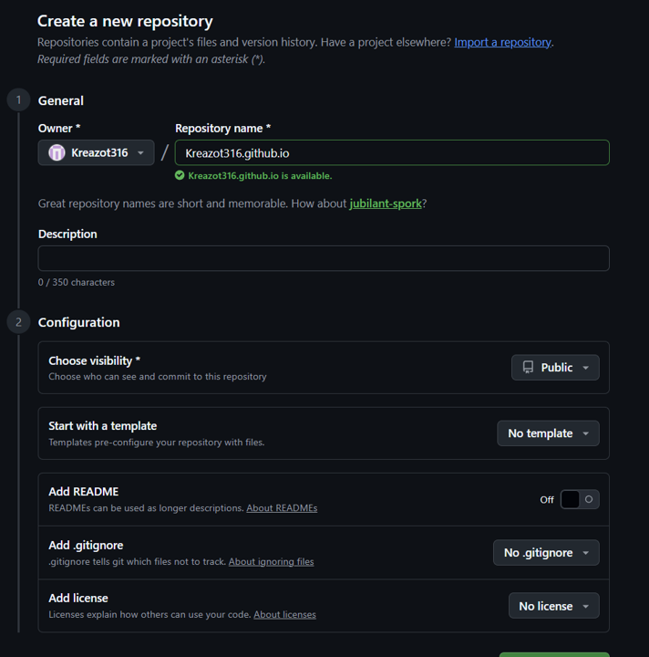
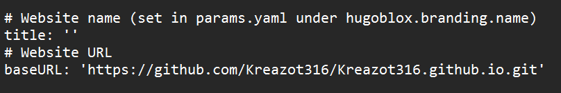
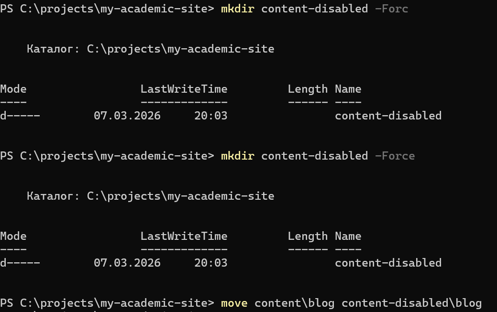
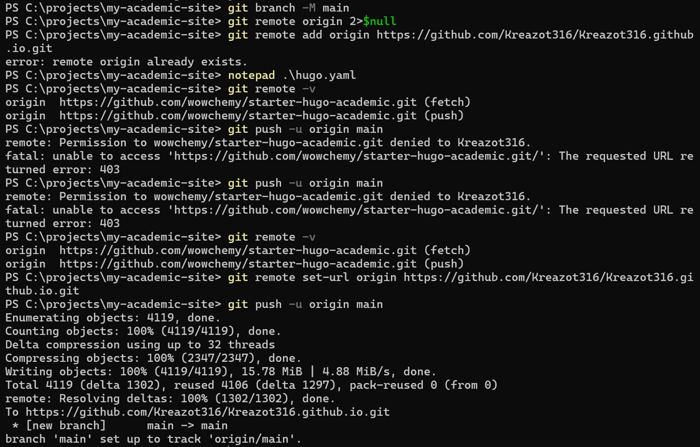
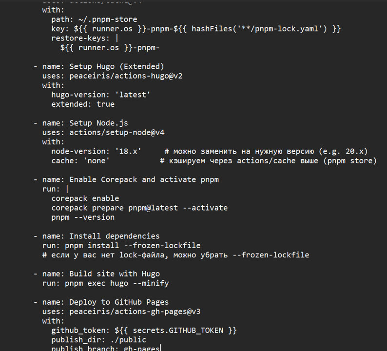
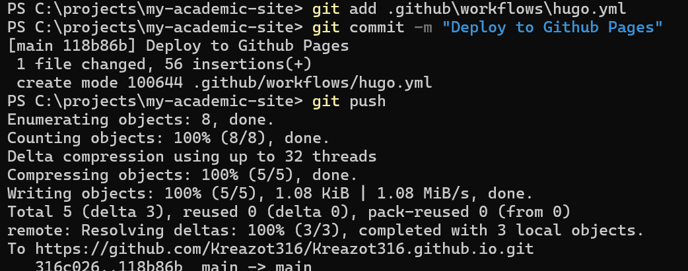

---
## Author
author:
  name: Карпухин Клим
  degrees: ""
  orcid: ""
  email: 1032255580@rudn.ru
  affiliation:
    - name: "Российский университет дружбы народов"
      country: "Российская Федерация"
      postal-code: 117198
      city: "Москва"
      address: "ул. Миклухо-Маклая, д. 6"
## Title
title: "Первый этап реализации индивидуального проекта"
subtitle: "Размещение на GitHub Pages заготовки для персонального сайта"
license: "CC BY"
date: 2026-03-07
date-format: "YYYY-MM-DD"
slide_level: 2

format:
  beamer:
    classoption: "aspectratio=169"
    pdf-engine: xelatex
    number-sections: false
    toc: false
    keep-tex: true

mainfont: "DejaVu Serif"
monofont: "DejaVu Sans Mono"
sansfont: "DejaVu Sans"
---

# Содержание

1. Информация о докладчике
2. Цель работы
3. Задание
4. Теоретическое введение
5. Ход работы (этапы, скриншоты)
6. Выводы

# Информация

## Докладчик

::: {.columns align="center"}
::: {.column width="65%"}

* **Карпухин Клим**
* Российский университет дружбы народов
* Email: [1032255580@rudn.ru](mailto:1032255580@rudn.ru)
* Роли: студент (индивидуальный проект)

:::
::: {.column width="35%"}
{width="90%"}
:::
:::

# Вводная часть

## Цель работы

* Создать базовую версию персонального веб-сайта с помощью генератора статических сайтов Hugo.
* Развернуть сайт на платформе GitHub Pages.
* Настроить автоматическое обновление сайта при изменениях в репозитории через GitHub Actions.

## Задание

1. Подготовить рабочее окружение: установить необходимое программное обеспечение.
2. Загрузить шаблон темы для будущего сайта.
3. Создать удалённый репозиторий на GitHub и связать его с локальной версией проекта.
4. Настроить параметр `baseURL` для корректной работы сайта на GitHub Pages.
5. Опубликовать заготовку сайта, используя механизмы GitHub Pages и GitHub Actions.

## Теоретическое введение

* **GitHub Pages** — сервис для размещения статических веб-страниц из репозиториев GitHub.
* **Hugo** — генератор статических сайтов, превращающий исходные файлы в готовый HTML, CSS и JavaScript.
* **GitHub Actions** — автоматизация сборки и публикации: при обновлении ветки `main` запускается процесс, который собирает сайт и размещает его на Pages.
* **Wowchemy (Hugo Academic Theme)** — стартовый шаблон на основе Hugo. Для обработки стилей через TailwindCSS необходимы Node.js и pnpm.

# Ход работы — подготовка окружения

## Этап 1: Установка необходимого ПО

* Установка Git, Go и Node.js через терминал.

{#fig-001 width="30%"}

## Этап 2: Установка Hugo Extended

* Установка расширенной версии Hugo (Hugo Extended) для поддержки SCSS/SASS и TailwindCSS.

{#fig-002 width="30%"}

# Ход работы — получение шаблона

## Этап 3: Клонирование шаблона и установка pnpm

* Создание рабочей директории, клонирование репозитория-шаблона `starter-hugo-academic`, установка pnpm.

{#fig-003 width="30%"}

## Этап 4: Запуск локального сервера

* Запуск локального сервера разработки Hugo для проверки внешнего вида.

{#fig-004 width="30%"}

## Этап 5: Просмотр локальной версии

* Сайт открылся в браузере по адресу `http://localhost:1313/` — базовая структура отображается корректно.

{#fig-005 width="30%"}

# Ход работы — создание репозитория

## Этап 6: Создание репозитория на GitHub

* Создание нового публичного репозитория `my-academic-site` на GitHub для хранения исходного кода.

{#fig-006 width="30%"}

## Этап 7: Настройка параметра `baseURL`

* В файле `hugo.yaml` указан `baseURL = https://kreazot316.github.io/my-academic-site/`.

{#fig-007 width="30%"}

## Этап 8: Подготовка контента для стабильной сборки

* Временное отключение раздела блога (перемещение `content/blog` в `content-disabled/blog`) для исключения ошибок.

{#fig-008 width="30%"}

# Ход работы — публикация проекта

## Этап 9: Отправка проекта на GitHub

* Инициализация Git-репозитория, добавление файлов, коммит и отправка в удалённый репозиторий.

{#fig-009 width="30%"}

## Этап 10: Настройка GitHub Pages и GitHub Actions

* В настройках репозитория выбран источник публикации **GitHub Actions**.

{#fig-010 width="30%"}

## Этап 11: Создание workflow-файла

* Создан файл `.github/workflows/hugo.yml` с описанием шагов сборки и деплоя.

{#fig-011 width="30%"}

## Этап 12: Отправка workflow в репозиторий

* Добавление, коммит и отправка workflow-файла на GitHub.

{#fig-012 width="30%"}

## Этап 13: Проверка результата

* Сайт доступен по адресу `https://kreazot316.github.io/my-academic-site/` и выглядит так же, как локальная версия.

{#fig-013 width="30%"}

# Выводы

## Выводы

* Выполнена начальная настройка проекта: установлено ПО, загружен шаблон Hugo, создан удалённый репозиторий.
* Настроена автоматическая сборка и публикация с помощью GitHub Actions.
* Заготовка персонального сайта доступна в интернете и готова к дальнейшему наполнению и модификации.
