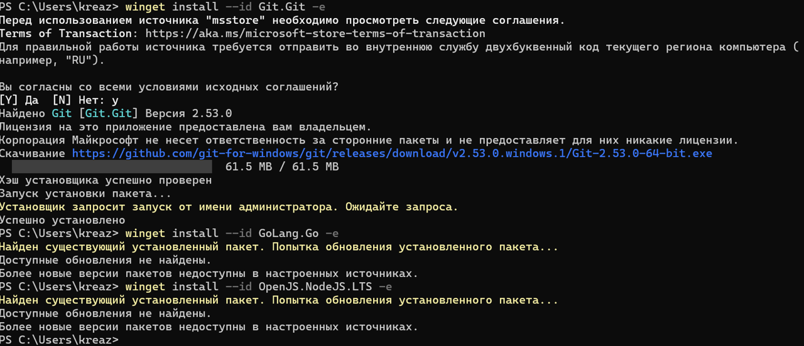
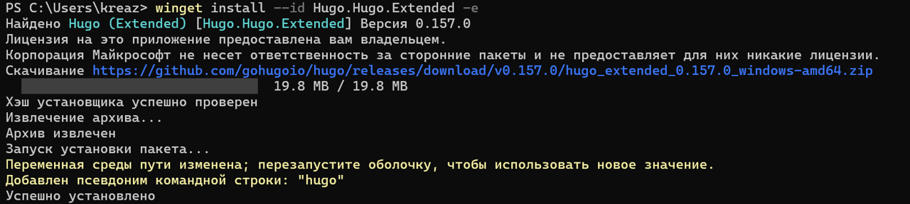
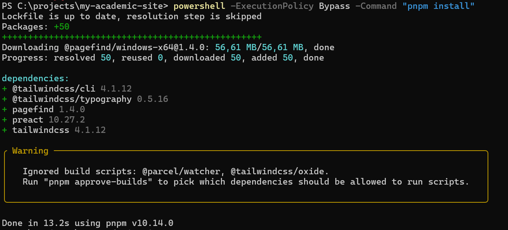
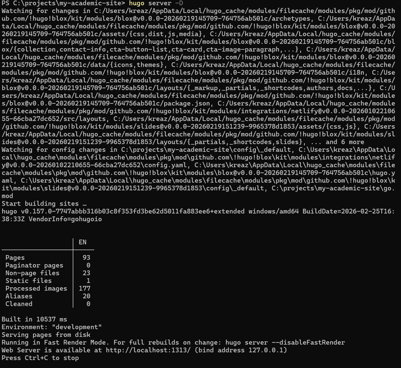

---

# Отчёт по первому этапу реализации индивидуального проекта

## Размещение на GitHub Pages заготовки для персонального сайта

###Студент: Карпухин Клим

---

## Цель работы

Основная цель этапа — создать базовую версию персонального веб-сайта с помощью генератора статических сайтов Hugo и развернуть его на платформе GitHub Pages, настроив автоматическое обновление сайта при изменениях в репозитории через GitHub Actions.

## Задание

1.  Подготовить рабочее окружение: установить всё необходимое программное обеспечение.
2.  Загрузить шаблон темы для будущего сайта.
3.  Создать удалённый репозиторий на GitHub и связать его с локальной версией проекта.
4.  Настроить параметр `baseURL` для корректной работы сайта на GitHub Pages.
5.  Опубликовать заготовку сайта, используя механизмы GitHub Pages и GitHub Actions.

## Теоретическое введение

GitHub Pages — это удобный сервис для размещения статических веб-страниц, которые хранятся в репозиториях GitHub.\
Hugo — один из популярных генераторов статических сайтов, превращающий исходные файлы (контент, шаблоны) в готовый набор HTML, CSS и JavaScript.\
Для автоматизации сборки и публикации используется GitHub Actions: при каждом обновлении ветки `main` запускается процесс, который устанавливает все зависимости, собирает сайт и размещает его на Pages.\
В проекте применяется стартовый шаблон Wowchemy (Hugo Academic Theme), основанный на Hugo. Для корректной обработки стилей через TailwindCSS в процессе сборки необходимы Node.js и менеджер пакетов pnpm.

## Выполнение работы

### 1. Установка необходимого ПО

Через терминал выполнил установку Git, языка Go и платформы Node.js — они потребуются для работы с репозиторием, Hugo и зависимостями ([рис. @fig-001]).

{#fig-001 width="70%"}

Затем установил расширенную версию Hugo (Hugo Extended), так как она поддерживает обработку SCSS/SASS и сборку с TailwindCSS ([рис. @fig-002]).

{#fig-002 width="70%"}

### 2. Получение шаблона сайта

Создал рабочую директорию, склонировал репозиторий-шаблон `starter-hugo-academic` и установил pnpm ([рис. @fig-003]).

{#fig-003 width="70%"}

Запустил локальный сервер разработки Hugo, чтобы проверить внешний вид будущего сайта ([рис. @fig-004]).

{#fig-004 width="70%"}

Сайт открылся в браузере по адресу `http://localhost:1313/` — базовая структура отображается корректно ([рис. @fig-005]).

{#fig-005 width="70%"}

### 3. Создание репозитория на GitHub

На сайте GitHub создал новый публичный репозиторий с именем `my-academic-site` (ссылку на него см. в начале отчёта) — это репозиторий, в котором будет храниться исходный код сайта ([рис. @fig-006]).

{#fig-006 width="70%"}

### 4. Настройка параметра `baseURL`

В корневой конфигурационный файл `hugo.yaml` внёс изменение: указал параметр `baseURL` равным `https://kreazot316.github.io/my-academic-site/`, чтобы все внутренние ссылки генерировались относительно этого адреса (сайт будет доступен по поддиректории) ([рис. @fig-007]).

{#fig-007 width="70%"}

### 5. Подготовка контента для стабильной сборки

Для исключения возможных ошибок при автоматической сборке (например, из-за ссылок на внешние изображения в демонстрационных материалах) временно отключил раздел блога, переместив каталог `content/blog` в `content-disabled/blog` ([рис. @fig-008]).

{#fig-008 width="70%"}

### 6. Публикация проекта в GitHub

Инициализировал Git-репозиторий в локальной папке, добавил все файлы, создал первый коммит и отправил изменения в созданный удалённый репозиторий `Kreazot316/my-academic-site.git` ([рис. @fig-009]).

{#fig-009 width="70%"}

### 7. Настройка GitHub Pages и GitHub Actions

В настройках репозитория на вкладке Pages выбрал источником публикации **GitHub Actions** — это позволит нам задать собственный сценарий сборки ([рис. @fig-010]).

{#fig-010 width="70%"}

Затем создал workflow-файл `.github/workflows/hugo.yml`. В нём описал последовательность шагов: установка Hugo Extended, установка Node.js, включение corepack для работы с pnpm, установка зависимостей проекта и финальная сборка командой `pnpm exec hugo --minify`. После успешной сборки артефакты публикуются на GitHub Pages ([рис. @fig-011]).

{#fig-011 width="70%"}

Добавил этот файл в локальный репозиторий, закоммитил и отправил изменения на GitHub ([рис. @fig-012]).

{#fig-012 width="70%"}

### 8. Проверка результата

После завершения первого запуска workflow открыл в браузере адрес `https://kreazot316.github.io/my-academic-site/`. Сайт успешно загрузился и выглядит так же, как локальная версия ([рис. @fig-013]).

{#fig-013 width="70%"}

## Выводы

На данном этапе была выполнена начальная настройка проекта: установлено всё необходимое ПО, загружен и адаптирован шаблон сайта на базе Hugo, создан удалённый репозиторий, настроена автоматическая сборка и публикация с помощью GitHub Actions. В результате заготовка персонального сайта доступна в интернете по адресу `https://kreazot316.github.io/my-academic-site/` и готова к дальнейшему наполнению и модификации.
